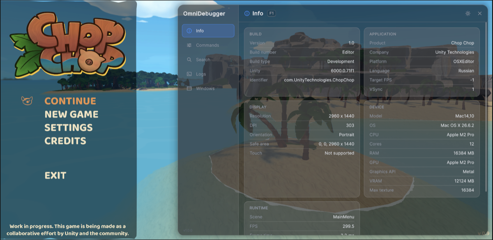

# OmniDebugger
[](https://unity.com/releases/editor/archive)

[](https://www.donationalerts.com/r/danilchizhikov)

## Overview
OmniDebugger is a runtime cheat and debug panel for Unity. It is built on UI Toolkit, so it draws on top of any
project without pulling in uGUI, TextMeshPro, or any other dependency.


Annotate a method or a property, hand the object over, and it becomes a debug command you can run by name:

```csharp
[DebugCommand("Economy", "Add Coins", Description = "Adds coins to the wallet.")]
[DebugTags("money", "wallet")]
public void AddCoins(int amount = 100) => _wallet.Coins += amount;
```

Then hand it to a debugger. In play mode the debugger puts the panel on screen itself, and
`Window → DTech → OmniDebugger` shows the same panel in a dockable editor window:

```csharp
_debugger = new OmniDebuggerHost();
_debugger.Catalog.AddSource(this);
```

## Table of Contents
- [Getting Started](#getting-started)
    - [Prerequisites](#prerequisites)
    - [Manual Installation](#manual-installation)
    - [UPM Installation](#upm-installation)
- [Enabling the Debugger](#enabling-the-debugger)
- [Usage](#usage)
    - [Declaring Commands](#declaring-commands)
    - [Commands Without Attributes](#commands-without-attributes)
    - [Running Commands](#running-commands)
    - [Searching](#searching)
    - [Reading the Log](#reading-the-log)
- [The Panel](#the-panel)
    - [At Runtime](#at-runtime)
    - [Opening It](#opening-it)
    - [Locking It](#locking-it)
    - [Tabs](#tabs)
    - [Floating Windows](#floating-windows)
    - [Command Icons](#command-icons)
    - [In the Editor](#in-the-editor)
- [Themes](#themes)
- [Extending the Panel](#extending-the-panel)
    - [Your Own Tab](#your-own-tab)
    - [Your Own Window](#your-own-window)
    - [Your Own Argument Field](#your-own-argument-field)
    - [Your Own Icons](#your-own-icons)
    - [Your Own Way In](#your-own-way-in)
    - [Your Own Mount](#your-own-mount)
    - [Styling and Redrawing](#styling-and-redrawing)
- [Code Stripping](#code-stripping)
- [Support](#support)
- [License](#license)

## Getting Started

### Prerequisites
- [GIT](https://git-scm.com/downloads)
- [Unity](https://unity.com/releases/editor/archive) 6000.0+

### Manual Installation
1. Download the .unitypackage from the [releases](https://github.com/DanilChizhikov/OmniDebugger/releases/) page.
2. Import com.dtech.omnidebugger.x.x.x.unitypackage into your project.

### UPM Installation
1. Open the manifest.json file in your project's Packages folder.
2. Add the following line to the dependencies section:
    ```json
    "com.dtech.omnidebugger": "https://github.com/DanilChizhikov/OmniDebugger.git",
    ```
3. Unity will automatically import the package.

If you want to set a target version, OmniDebugger uses the `v*.*.*` release tag so you can specify a version like #v1.0.0.

For example `https://github.com/DanilChizhikov/OmniDebugger.git#v1.0.0`.

## Enabling the Debugger

The runtime assembly is gated behind the `OMNI_DEBUGGER` scripting define. Without it the assembly is not
compiled at all, so a shipping build carries none of it — no stripped-down stub, no no-op calls, nothing.

Turn it on per build target in **Project Settings → DTech → OmniDebugger**. Because the define may be on for
one platform and off for another, and off entirely in a release build, **your own calls into OmniDebugger belong
inside `#if OMNI_DEBUGGER`**:

```csharp
#if OMNI_DEBUGGER
private OmniDebuggerHost _debugger;
#endif

private void Awake()
{
#if OMNI_DEBUGGER
    _debugger = new OmniDebuggerHost();
    _debugger.Catalog.AddSource(this);
    _debugger.Groups.SetOrder("Economy", 10);
#endif
}

private void OnDestroy()
{
#if OMNI_DEBUGGER
    _debugger?.Dispose();
#endif
}
```

That debugger is yours: you construct it, you hold it, and you dispose it. Disposing releases every registered
source — MonoBehaviours included — and clears the catalog's subscribers.

Or leave the lifetime to the package and read `OmniDebuggerHost.Shared`. It hands out the first debugger built and not
disposed yet, and while there is none it builds one from the project settings right there, so any script reaches
the same debugger without passing it around:

```csharp
#if OMNI_DEBUGGER
private void OnEnable() => OmniDebuggerHost.Shared.Catalog.AddSource(this);

private void OnDisable()
{
    if (OmniDebuggerHost.TryGetShared(out OmniDebuggerHost debugger))
    {
        debugger.Catalog.RemoveSource(this);
    }
}
#endif
```

`TryGetShared` reads the slot without building anything, which is what teardown code wants. A debugger `Shared`
built itself is disposed by the package once play mode is over in the editor; one your code built stays yours to
dispose, and a debugger built next to it never replaces it. Turn on *Create On Startup* (see
[At Runtime](#at-runtime)) to have the shared debugger built before the first scene loads.

## Usage

### Declaring Commands

Put `[DebugCommand(group, name, sortOrder)]` on a **public instance** member. `name` defaults to the member name,
and `Description` is an optional named argument. `[DebugTags]` adds extra phrases the command can be searched by.

| Member | Becomes | Notes |
|---|---|---|
| `void` method | `CommandKind.Action` | One argument per parameter; optional parameters stay optional |
| property with public get **and** set | `CommandKind.Value` | Running it writes the value |
| property with public get only | `CommandKind.ReadonlyValue` | A private setter counts as read-only |

Static members, non-public methods, methods that return a value, generic methods, `ref`/`out` parameters, and
properties without a public getter are skipped with a warning naming the member and the reason — so a rejected
command is never silently missing. A property is judged by its getter alone: a public get makes it a command
however private its setter is.

Arguments accept anything `IConvertible` (all numerics, `bool`, `char`, `string`, `DateTime`), any `enum`, and
`Nullable<T>` of those. Text is always read with the invariant culture, so a device locale can never turn `"1.5"`
into `15`.

`[DebugRange(min, max)]` on a numeric property or parameter turns its field into a slider with a value box, and
`Step` snaps it:

```csharp
[DebugCommand("World"), DebugRange(0, 4, Step = 0.25)]
public float TimeScale { get => Time.timeScale; set => Time.timeScale = value; }

[DebugCommand("World")]
public void Teleport([DebugRange(-100, 100)] int x, [DebugRange(-100, 100)] int y) { … }
```

A range is a hint for the panel, which keeps what is typed inside it; code that runs the command is not held to it.
It covers `int`, `short`, `ushort`, `byte`, `sbyte`, `float` and `double` — other types keep a plain field — and a
range with its maximum not above its minimum skips the member with a warning. Commands built in code pass the same
thing as `new ArgumentDefinition(name, type, range: new ArgumentRange(0, 4, 0.25))`.

The panel lists groups by their order, then by name. `debugger.Groups.SetOrder("Economy", 10)` moves a group up —
lower comes first, and a group never given an order sits at 1000 (`CommandDefinition.DefaultSortOrder`). Inside a
group, commands follow their `sortOrder`, then their name.

Registration is always explicit. Nothing scans your assemblies, so startup costs only what you hand over — and
each type is reflected over exactly once for the lifetime of the domain, however many instances you register.

```csharp
_debugger.Catalog.AddSource(myShopService);
_debugger.Catalog.RemoveSource(myShopService);   // removes exactly what that object contributed
```

### Commands Without Attributes

For commands built at runtime, or on a type you do not own:

```csharp
_debugger.Catalog.AddCommand(new ActionCommand(
    new CommandDefinition("Reload Scene", "Flow", CommandKind.Action),
    () => SceneManager.LoadScene(SceneManager.GetActiveScene().buildIndex)));

_debugger.Catalog.AddCommand(new ReadonlyValueCommand(
    new CommandDefinition("FPS", "Stats", CommandKind.ReadonlyValue),
    () => 1f / Time.smoothDeltaTime));

_debugger.Catalog.AddCommand(new ValueCommand(
    new CommandDefinition("Time Scale", "World", CommandKind.Value, arguments: new[]
    {
        new ArgumentDefinition("value", typeof(float), range: new ArgumentRange(0, 4, 0.25)),
    }),
    () => Time.timeScale,
    value => Time.timeScale = (float)value));
```

Each class checks the definition's `CommandKind` and throws `ArgumentException` on a mismatch. A `ValueCommand`'s
definition carries exactly one `ArgumentDefinition` describing the value: its type picks the panel's control and the
type the setter receives, and without it the panel has nothing to edit the value with. `RemoveCommand` takes a
command added this way out again.

A whole object can also supply its own list by implementing `ICommandSource`, which opts it out of reflection
entirely. The list is read once, when the object is added, and `RemoveSource` takes all of it away again:

```csharp
public sealed class ShopCheats : ICommandSource
{
    private readonly Shop _shop;

    public ShopCheats(Shop shop) => _shop = shop;

    public IEnumerable<IDebugCommand> GetCommands()
    {
        foreach (Item item in _shop.Catalog)
        {
            yield return new ActionCommand(
                new CommandDefinition($"Give {item.Name}", "Shop", CommandKind.Action),
                () => _shop.Give(item));
        }
    }
}

_debugger.Catalog.AddSource(new ShopCheats(_shop));
```

When a delegate is not enough, implement the interfaces yourself: `IExecutableCommand` for something that runs,
`IReadableCommand` for something that reports a value, both for a value that can be written. `Definition` must never
change; `CommandDefinition.Kind` only tells the panel which control to draw.

### Running Commands

Commands are addressed by a readable key, `"Group/Name"`, so it can be typed into a console or stored in a config.

```csharp
_debugger.Commands.TryExecute("Economy/Add Coins", InvocationRequest.From("Console", 500));
_debugger.Commands.TryExecute("Economy/Add Coins", InvocationRequest.From("Console", "500"));  // text is coerced
_debugger.Commands.TryGetValue("Stats/FPS", out object fps);
```

`TryExecute` returns `false` and logs the reason when the command is missing, is not runnable, gets arguments it
cannot bind, or throws. A command that throws never escapes into the caller, and the exception is unwrapped so the
console shows your stack rather than reflection's. A null or blank key is the one case that is not a `false`: it
throws `ArgumentException`, because an empty key is a bug in the caller rather than a command that failed.

Every invocation is logged *before* it runs — a command that hard-kills the process still leaves a record of what
did it.

The catalog itself is readable the same way: `Commands` is an `IReadOnlyList<CommandDefinition>` snapshot,
`TryGetDefinition` looks one up by key, and `TryGetCommand` hands back the `IDebugCommand` behind it when you want
to call `Execute` or `GetValue` yourself.

```csharp
_debugger.Catalog.OnChanged += Refresh;   // fires after every add or remove
```

`OnChanged` is what a panel — or a search index — hangs off of, since registration can happen at any point in a
session. Disposing the debugger drops every subscriber along with the commands.

All of `ICommandCatalog`, `ICommandInvoker`, and `IGroupOrder` are main-thread only and throw
`InvalidOperationException` when called from anywhere else, rather than quietly doing nothing.

### Searching

`SearchIndex<T>` finds anything implementing `ISearchIndexable`, which `CommandDefinition` does. Items sit behind
an inverted index, so a query reads the words that were typed and the items those words belong to — never the
whole catalog.

```csharp
SearchIndex<CommandDefinition> index = new SearchIndex<CommandDefinition>();
index.Rebuild(_debugger.Catalog.Commands);          // re-index when the catalog changes

SearchSession<CommandDefinition> session = index.BeginQuery(_field.value, default);
session.OnUpdated += Repaint;                       // hits are republished after each stage

// Drive it with whatever slice of the frame you can spare.
session.Advance(budgetTicks: Stopwatch.Frequency / 2000);   // ~0.5 ms

foreach (SearchHit hit in session.Hits)
{
    CommandDefinition command = index[hit.Id];      // a hit is an id, a score, and the stage that found it
}
```

A hit does not carry the item — `SearchHit` is `Id`, `Score`, and `Stage`, and the indexer turns the id back into
what you put in. Ids are stable for the life of an entry and are never handed out twice, so one can be held across
frames; `index.Count` is how many entries are live.

An index keeps a single session. `BeginQuery` restarts the one it owns, so a second call replaces the query that
was running rather than starting a second one — which is what a panel that re-queries on every keystroke wants,
and why the returned session should not be stored beyond the current query.

Work is handed out in slices the caller pays for, so a search never owns a frame. Stages run cheapest first —
`SearchStage.Exact` (whole word), `Prefix`, `Infix` (substring), then `Fuzzy` (near-miss) — and `session.Hits` is
rebuilt after each one, best first. The first slices already hold what a person is most likely to want, while the
expensive near-miss work is still outstanding; `session.Stage` says what is being worked on and
`session.IsComplete` says when there is nothing left. `hit.Stage` is how good a match it was, so it also reads as
"exact matches above guesses".

`Advance` takes a budget in `Stopwatch` ticks and returns `true` while work remains. A budget of zero still does
one unit of work, so too small a slice cannot livelock the caller. To spend a budget per frame without writing the
loop, `await session.RunAsync(budgetTicks, cancellationToken)`; `session.Cancel()` stops a query where it stands
and leaves `Hits` readable.

Each phrase is indexed as its own words, as the words run together, and as their initials, so *Add Coins* is
found by `"coins"`, `"add coins"`, `"addcoins"` and `"ac"` alike. Run-together names are split on camel humps and
where letters meet digits. Near-miss matching uses edit distance, so `"coibs"` still finds *Add Coins*. Every
extra word narrows the result rather than widening it.

`QuerySettings` caps how many hits are kept and can turn stages off (`SearchOptions.ExactOnly`,
`SearchOptions.NoFuzzy`) or demand matching letter case (`SearchOptions.CaseSensitive`). An empty term completes
immediately with no hits — read that as "show everything".

For a large set, `RebuildAsync` gathers phrases on the main thread and builds the index on a worker, swapping it
in when it is ready; queries keep answering from the previous index until then. `Add` and `Remove` keep
single-item changes cheap, and the index folds them into the bulk data on its own once they add up. `Clear` empties
it without throwing the index away, and `Dispose` retires it for good — every call after that throws
`ObjectDisposedException`.

Like the catalog, the index is main-thread only, `RebuildAsync`'s worker excepted, and says so by throwing rather
than by misbehaving quietly.

### Reading the Log

`debugger.Logs` (`ILogFeed`) is Unity's console as the debugger captured it — the same records the Logs tab shows,
readable from code and from any thread. A query reads one page at a time:

```csharp
List<LogRecord> page = new List<LogRecord>();
LogQuery query = new LogQuery(tags: new[] { "Net" }, types: LogTypeMask.Warning | LogTypeMask.Error, limit: 20);

bool hasOlder = _debugger.Logs.Query(query, page);   // the newest 20 matches, oldest first
long newest = page.Count > 0 ? page[page.Count - 1].Id : 0;

// Later: only what arrived since. Before(page[0].Id) pages the other way, towards older records.
page.Clear();
_debugger.Logs.Query(query.After(newest), page);
```

`Query` appends to the list it is given and returns `true` while more matches lie beyond the page, in the direction
it grew. The default `LogQuery` matches everything; `Text` looks in messages and stack traces without regard to
case, `Tags` with `LogTagMode.All` or `Any` filters by the leading `[Tag]` prefixes of a message, and `Limit`
defaults to 64. Record ids only grow, so an id is a safe bookmark.

`Version` grows with every record and every `Clear`, which makes it a cheap "anything new?" check. `ErrorCount`
counts errors, asserts and exceptions since the debugger was built and never goes down, not even on `Clear`.
`CountByType` and `GetKnownTags` report what is kept right now.

## The Panel

The panel is one view (`OmniDebuggerView`) mounted in two places: over the running game, and in an editor
window. Both show the same tabs and themes; they differ only in where they draw and where they save choices.

The theme and favourites are the only choices the panel saves, plus the scale of the floating windows over the
game and where the open button was dragged to. Pins, the open tab and group and where a floating panel was moved to
survive the panel being rebuilt, but not a restart.

What the panel shows follows the game on its own. While a row is on screen — in the Commands tab, a search result
or a floating window — its value is re-read four times a second: a read-only value, and the control of a property
too, so a property your code changes moves its switch, slider or field. A control being edited is left alone until
the edit is committed or undone. When that is not soon enough, or after a change only a redraw picks up — an icon
registered late, a tab of your own — ask for a redraw:

```csharp
OmniDebuggerHost.Shared.Refresh();   // every view of this debugger: runtime panel, editor window, floating windows
```

Calls made within one frame are merged into one redraw. The selected tab gets `IOmniDebuggerTab.Refresh`, and
`IOmniDebuggerHost.OnRefreshRequested` reaches content of your own, such as a custom floating window — see
[Styling and Redrawing](#styling-and-redrawing).

### At Runtime

Constructing the debugger in play mode is all it takes. It builds the panel, the open button and the log capture
itself, and takes them down again on `Dispose`:

```csharp
#if OMNI_DEBUGGER
private OmniDebuggerHost _debugger;

private void Awake()
{
    _debugger = new OmniDebuggerHost();
    _debugger.Catalog.AddSource(this);
}

private void OnDestroy() => _debugger?.Dispose();
#endif
```

With *Create On Startup* on, not even that is needed: the package builds `OmniDebuggerHost.Shared` before the first
scene loads, so the log is captured from the very first frame and the panel is there without a line of code.
Scripts register their commands through `OmniDebuggerHost.Shared`. A debugger built with `new` next to it puts a second
panel on screen, and says so in the console.

How it looks and opens is set in **Project Settings → DTech → OmniDebugger → Panel**. The page shows up while
`OMNI_DEBUGGER` is on for the active build target:

| Section | Options |
|---|---|
| Startup | `CreateOnStartup`, `CreatePanel`, `OpenOnStart` |
| Layout, Scaling and Layering | `LandscapeLayout`, `FloatingScale`, `ScaleMode`, `Scale`, `SortingOrder`, `PanelSettings` (left empty, the shipped asset is cloned, never edited) |
| Open Button | `ButtonEnabled` (*Open Button Enabled*), `ButtonClicks`, `MultiClickWindow`, `ButtonAnchor`, `ButtonOpacity` |
| Shortcuts | `Shortcuts` |
| Lock | `Lock` — see [Locking It](#locking-it) |
| Themes | `DefaultTheme`, extra `Themes` |
| Icons | `IconCatalogs` |

In code, `CreateOnStartup`, `CreatePanel`, `DefaultTheme`, `Themes` and `IconCatalogs` sit on `OmniDebuggerOptions`;
everything else sits on `OmniDebuggerOptions.Panel` (`OmniDebuggerPanelOptions`), with the button and the shortcuts
under `Panel.Open` and the lock under `Panel.Lock`.

The settings live in `ProjectSettings/OmniDebuggerSettings.asset`: versioned with the project, nothing added to
`Assets`. Play mode reads them live: a debugger built without options in code, and its panel, pick up every edit
made on the page while the game runs. A build gets a snapshot — right before it
starts, the settings are written to a generated `Resources` asset, which is deleted again once the build is done.
That only happens while `OMNI_DEBUGGER` is on for the target, so a release build carries neither the settings nor
the themes, catalogs and panel settings they point at.

`new OmniDebuggerHost()` reads these settings, and so does `OmniDebuggerOptions.Default`, which hands out a copy — change
a few values in code and pass it on:

```csharp
OmniDebuggerOptions options = OmniDebuggerOptions.Default;       // the project settings, copied
options.Panel.Open.Shortcuts.Add(new OmniDebuggerShortcut(KeyCode.LeftControl, KeyCode.BackQuote));

_debugger = new OmniDebuggerHost(options);
```

Options passed to the debugger replace the project settings as a whole — later edits to the page no longer reach it;
`new OmniDebuggerOptions()` starts from the package's built-in defaults instead.

Set `CreatePanel = false` to build the panel yourself instead: drop `OmniDebuggerPanel` on a GameObject and call
`Bind(debugger)`, or let `OmniDebuggerPanel.Create(debugger, panelOptions)` make one on an object that survives scene
loads. The component has no options of its own — it reads the same project settings, and code can change
`panel.Options` before binding. Its `UIDocument` is optional: leave it empty and one is created. `Unbind()` tears the
panel down and leaves the component ready for another debugger. The panel a debugger built itself is
`OmniDebuggerHost.Panel` — null with `CreatePanel` off or outside play mode. To put the panel into UI of your own
rather than over the game, see [Your Own Mount](#your-own-mount).

**Scaling.** Every size is written for a portrait phone 360 units wide. `ScreenSize` scales that with the screen,
so the panel looks the same on every phone and leans towards the height in landscape instead of tripling in size.
`PhysicalSize` reads the same units as desktop pixels at 96 DPI. `Auto`, the default, picks `ScreenSize` on mobile
platforms and `PhysicalSize` elsewhere. `OmniDebuggerPanel.SetScale` changes it on the spot.

**Layout.** Held upright, the panel is a glass sheet edge to edge, with the tabs in a strip along the top. Turned
sideways, the tabs move into a sidebar and the panel becomes a floating window over the game, no bigger than
296 × 227 units at the default floating scale — or runs edge to edge with *Landscape Layout* set to *Full Screen*
(Panel settings → *Layout, Scaling and Layering*, `LandscapeLayout`). The game stays live around a floating panel: a
tap beside it reaches the game and never closes the panel — × or a shortcut does. Drag the window by its top bar to
move it; it stays on screen and keeps its place for the session. *Floating Scale* (`FloatingScale`, 1 by default — a
compact window with smaller text than edge to edge) shrinks or grows it on top of the panel's own scaling, never past
the screen. Command sections switch to two columns once there is room. The panel keeps out of the notch and the home
indicator; edge to edge, its glass reaches under the notch while the content stays clear of it.

<table>
  <tr>
    <td rowspan="2" align="center">
      <br>
      <sub>Portrait</sub>
    </td>
    <td align="center">
      <br>
      <sub>Landscape, floating</sub>
    </td>
  </tr>
  <tr>
    <td align="center">
      <br>
      <sub>Landscape, <i>Full Screen</i></sub>
    </td>
  </tr>
</table>

**Input after an EventSystem is rebuilt.** With uGUI in the project, UI Toolkit routes taps through an object Unity
parents under the EventSystem. The panel owns that object itself and re-asserts it every frame, so destroying the
EventSystem and creating a new one does not leave it deaf to taps.

### Opening It

| Way in | Configured by |
|---|---|
| The floating button — tap it, or tap it `ButtonClicks` times in a row | Panel settings → *Open Button* (`Open.ButtonEnabled`, `Open.ButtonClicks`, `Open.MultiClickWindow`, `Open.ButtonAnchor`, `Open.ButtonOpacity`) |
| A keyboard shortcut — one key, or a chord that fires when its last key goes down; each toggles the panel | Panel settings → *Shortcuts* (`Open.Shortcuts`) |
| Code | `OmniDebuggerPanel.Open()` / `Close()` / `Toggle()` |
| A gesture of your own in place of the button | `OmniDebuggerPanel.SetGesture` — see [Your Own Way In](#your-own-way-in) |

The button is a small glass square. It starts at the corner or edge `ButtonAnchor` names, at `ButtonOpacity`
(0.5 by default), and lights up — full opacity, accent ring and glow — on every tap, so a series of taps shows each
one landed.
Hold the button for 0.6 seconds and corner brackets slide out: now it can be dragged. It stays where it was dropped,
across restarts too (saved in `PlayerPrefs`) until `ButtonAnchor` changes, and inside the safe area when the screen
turns. It turns red and pulses for 45 seconds whenever an
error is logged, until it is tapped. Hide it at runtime with `SetOpenButtonEnabled(false)`, or replace it with
`SetGesture(IOmniDebuggerGesture)` (see [Your Own Way In](#your-own-way-in)).

To bind a shortcut, press *Add Shortcut*, click the new field, hold the keys and release them; `Esc` cancels and `×`
removes the row. Shortcuts are `KeyCode`s whichever input backend runs: the Input System package is used when it is
installed and active, the legacy Input Manager otherwise. Shift, Ctrl, Alt and Cmd/Win match either side of the
keyboard. Nothing is required: with neither backend, shortcuts stay silent and the button still works.

### Locking It

Panel settings → *Lock* makes the runtime panel ask for a PIN or a password before it shows. Every way in — the
button, a shortcut, `Open()` and *Open On Start* — goes through the prompt; the editor window never asks.

| Option | What it does |
|---|---|
| `Lock.Mode` | `None`, `Pin` — 4 to 12 digits on the panel's own keypad (a hardware keyboard types too), or `Password` — any characters in a masked field |
| *New PIN / New Password* → *Set* | Stores a salted SHA-256 hash of what was typed; *Clear* forgets it. From code: `Lock.SetSecret("1234")` / `Lock.ClearSecret()` |
| `Lock.UnlockScope` | `EveryOpen` asks each time, `Session` once until the app restarts, `Device` once on this device until the secret changes |
| `Lock.SkipInEditor` | On by default: play mode in the editor opens without asking |
| `Lock.MaxAttempts` / `Lock.CooldownSeconds` | After 5 wrong entries in a row the prompt pauses for 30 seconds; 0 attempts never pauses |

Neither the project settings nor a build hold the secret itself, only its hash. That keeps testers and players from
wandering in, not a determined attacker: the hash ships with the build, and a short PIN is quick to guess from it.
With a mode picked but no secret set, the panel opens without asking and the settings page warns about it.

### Tabs

| Tab | What it does |
|---|---|
| **Info** | Build, application, display, device, and live runtime figures (FPS, frame time, memory, battery, network) |
| **Commands** | A section per group, favourites first: unfold one to use its commands right there, or tap its header to open the group on a page of its own. Each command is a row — icon, name and its control: a switch for a `bool`, a slider for a ranged number, a field, a dropdown, a ▶ that runs it (arguments beside it or under it), or a read-only value. Values and property controls follow the game live. *⋯* holds the favourite star, the pin, the description, the id and the tags |
| **Search** | Finds commands by name, group or tag, optionally case-sensitive; tap a result for its row and details |
| **Logs** | Unity's console, captured since the debugger was built: type toggles with counts, text search over messages and stack traces, `[Tag]` prefixes to filter by (all or any), copy one or everything, clear. It follows new logs while scrolled to the bottom and loads older ones at the top |
| **Windows** | Every floating window, with a switch to show or hide it, *Hide all*, and one *Window scale* slider (×0.5 to ×2) shared by every window |

Favourites are saved; pins last for the session only. The captured log is also readable in code through
`debugger.Logs` (`ILogFeed`) — see [Reading the Log](#reading-the-log). Tabs of your own sit next to these, and any
of these can be dropped — see [Your Own Tab](#your-own-tab).

The log keeps up to 16 384 records within a budget of about 4 million characters of text (some 8 MB), dropping the
oldest first. A message
repeated word for word is stored once and shared by its records, so repeats cost a record but no text, and a
filter reads each distinct message once rather than once per repeat.

### Floating Windows

Windows float over the game while the panel is closed — a live readout, or a few commands to hit while playing —
and stay next to a floating panel while it is open. Each time the panel opens they start above it; after that,
whichever was touched last, the panel or a window, is on top. Drag one by its header, collapse it, close it; it
turns opaque while you use it. An edge-to-edge panel hides them until it closes. The Windows tab sizes them all
at once, ×0.5 to ×2 in steps of 0.1, and the game remembers that scale across restarts.

Pinning a command collects it in the built-in *Pinned* window. Windows of your own — a list of commands, or anything
UI Toolkit can draw — are registered through `debugger.Windows`; see [Your Own Window](#your-own-window).

### Command Icons

```csharp
[DebugCommand("Economy"), DebugIcon(DebugIconSource.Resources, "Icons/Coin")]
public void AddCoins(int amount) { … }
```

`Resources` keys load a sprite or texture from a `Resources` folder. `Catalog` keys are looked up in
`OmniDebuggerIconCatalog` assets (**Create → DTech → OmniDebugger → Icon Catalog**) found in a
`Resources/OmniDebugger` folder, listed under *Icons* in the Panel settings, or passed to `debugger.Icons.AddCatalog`.
Each catalog entry is a key with a sprite or a texture; the sprite wins when both are set. To serve icons from
anywhere else, see [Your Own Icons](#your-own-icons).

### In the Editor

`Window → DTech → OmniDebugger` opens the same panel in a dockable window. It binds on its own to the newest live
debugger — every `OmniDebuggerHost` announces itself on construction.

The window saves its theme and favourites in `EditorPrefs` while the game saves its own in `PlayerPrefs`, so the
two never move each other. The window's theme can also be picked in **Project Settings → DTech → OmniDebugger → UI**.
Floating windows and pins belong to the runtime panel only; the editor window's Windows tab still lists the windows
and opens or closes them over the game.

The same page sets how the window shows the panel, per user in `EditorPrefs` and live:

- **Layout** — *Auto* follows the window's shape (tabs on top while it is taller than wide, in a sidebar otherwise);
  *Portrait* and *Landscape* keep one layout whatever the shape.
- **Zoom** — the panel is scaled to fit the window the way `ScreenSize` scales it on a device; 1 is the size it has
  on a phone as big as the window, lower is smaller and fits more. It runs from 0.5 to 1.25.

The window shows the panel opaque and filling the window: the glass, the margin and the shadow belong to the
runtime overlay, where there is a game behind them.

## Themes

A theme is an `OmniDebuggerTheme` asset holding an ordered list of plain `.uss` sheets. The panel applies its own
skin first, then a complete set of dark tokens, then your sheets — last, so your values win. Because the token
set underneath is always complete, a theme that redefines one variable is perfectly valid.

```css
/* Assets/UI/OceanTheme.uss */
.od-root {
    --od-color-glass: rgba(15, 23, 36, 0.86);         /* the panel over the game */
    --od-color-bg: rgb(15, 23, 36);                   /* the panel in the editor window */
    --od-color-card: rgba(56, 189, 248, 0.05);
    --od-color-text: rgb(226, 236, 248);
    --od-color-accent: rgb(56, 189, 248);
    --od-color-glow: rgba(56, 189, 248, 0.38);
    --od-color-control-selected: rgba(56, 189, 248, 0.16);
    --od-radius-lg: 10px;
}
```

1. **Create → DTech → OmniDebugger → Theme**, name it, drag the `.uss` into *Style Sheets*.
2. Set it as *Default Theme* or list it under *Themes* in the Panel settings, or call
   `debugger.Themes.Register(theme)`.
3. The panel's theme switcher offers it, and the editor window's settings list it. No code.

What the switcher offers depends on what is set:

| Set | Themes offered | Switcher |
|---|---|---|
| Nothing | built-in Dark and Light | one button toggling the two |
| *Default Theme* only | that theme alone | hidden |
| *Themes* (or `Register`), with or without *Default Theme* | built-in Dark and Light, the listed ones and the default | dropdown, starting from *Default Theme* |

Every colour, spacing, radius, font size and metric the panel draws with is a `--od-*` variable; the full list is
in `Runtime/UI/Resources/OmniDebugger/OmniDebuggerTokensDark.uss`. Want a light base? List the package's
`OmniDebuggerTokensLight.uss` first in your theme, then your own sheet.

The built-in palettes are Glass + Electric Blue, dark and light. UI Toolkit has no backdrop blur, so the glass is
layered: a translucent panel (`--od-color-glass`) with a lighter top edge, tiles washed faintly over it, fields
sunk into darker wells, and one accent (`--od-color-accent`) kept for what is selected, on or runnable. Soft
glows and shadows are drawn by the panel itself in `--od-color-glow` and `--od-color-shadow`.

A few variables are read from C# and must stay unitless: `--od-value-refresh-ms` (how often values in the Commands
tab are re-read) and the halo sizes `--od-shadow-size`, `--od-shadow-size-sm`, `--od-glow-size` and `--od-glow-size-sm`.

Use `.uss`, not `.tss`: Unity marks a theme style sheet as a default sheet, and default sheets lose every
specificity tie, so overrides in a `.tss` would silently do nothing. The one `.tss` the package ships is the
panel-level theme a runtime panel needs for Unity's own controls to render at all.

## Extending the Panel

Every extension point hangs off the debugger — `debugger.Tabs`, `debugger.Windows` and so on — so what you add lives
and dies with that debugger and reaches every view of it, the runtime panel and the editor window alike. There is no
static registry to clean up. Register right after building the debugger, from the main thread.

| To add | Implement or call | See |
|---|---|---|
| A page in the tab bar, or fewer built-in ones | `IOmniDebuggerTabFactory` + `IOmniDebuggerTab`, `debugger.Tabs` | [Your Own Tab](#your-own-tab) |
| A pane floating over the game | `debugger.Windows.RegisterCustom` / `RegisterCommands` | [Your Own Window](#your-own-window) |
| A control for an argument type | `IArgumentFieldHandler` + `IArgumentField`, `debugger.Fields` | [Your Own Argument Field](#your-own-argument-field) |
| Icons from an atlas, Addressables, anywhere | `IOmniDebuggerIconProvider`, `debugger.Icons` | [Your Own Icons](#your-own-icons) |
| Another way to open the panel | `IOmniDebuggerGesture`, `OmniDebuggerPanel.SetGesture` | [Your Own Way In](#your-own-way-in) |
| The panel inside UI of your own | `OmniDebuggerView` | [Your Own Mount](#your-own-mount) |
| A skin | `OmniDebuggerTheme`, `debugger.Themes` | [Themes](#themes) |
| Commands | attributes, `ICommandSource`, `ActionCommand` and friends | [Usage](#usage) |

### Your Own Tab

```csharp
internal sealed class SavesTabFactory : IOmniDebuggerTabFactory
{
    public string Id => "saves";
    public string DisplayName => "Saves";
    public int Order => 35;   // built-ins: Info 0, Commands 10, Search 20, Logs 30, Windows 40
    public CommandIcon Icon => new CommandIcon(DebugIconSource.Resources, "Icons/Save");   // default: a generic glyph

    public IOmniDebuggerTab CreateTab(in OmniDebuggerTabContext context) => new SavesTab(context);
}

internal sealed class SavesTab : IOmniDebuggerTab
{
    private const string SlotKey = "slot";

    private readonly OmniDebuggerTabContext _context;
    private readonly Label _summary = new Label();
    private readonly IntegerField _slot = new IntegerField("Slot");
    private readonly IVisualElementScheduledItem _poll;

    public VisualElement Root { get; } = new VisualElement();

    public SavesTab(OmniDebuggerTabContext context)
    {
        _context = context;

        if (context.State.TryGetValue(SlotKey, out object slot))
        {
            _slot.SetValueWithoutNotify((int)slot);   // what was typed survives a rebuild
        }

        _slot.RegisterValueChangedCallback(evt => context.State.SetValue(SlotKey, evt.newValue));

        Root.Add(_summary);
        Root.Add(_slot);
        Root.Add(new Button(Wipe) { text = "Wipe slot" });

        _poll = Root.schedule.Execute(Refresh).Every(1000);
        _poll.Pause();   // ticks only while the tab is on screen
    }

    public void OnOpen() => _poll.Resume();

    public void OnClose() => _poll.Pause();

    public void Refresh() => _summary.text = $"{SaveSystem.SlotCount} slots, {SaveSystem.TotalBytes / 1024} KB";

    public void Dispose() => _poll.Pause();

    private void Wipe() =>
        _context.Debugger.Commands.TryExecute("Saves/Wipe", InvocationRequest.From(_context.Origin, _slot.value));
}

debugger.Tabs.Register(new SavesTabFactory());
```

The icon resolves like a command icon (see [Command Icons](#command-icons)) and is tinted with the tab's text
colour, so draw it white on transparent.

**Lifecycle.** A tab is built the first time it is selected, once per view — the runtime panel and the editor window
each build their own, so a tab never reaches for a singleton. `Root` is read once, right after `CreateTab`.
`OnOpen` runs when the tab becomes the visible one and again whenever the panel opens on it; `OnClose` when another
tab is picked or the panel closes. Start and stop timers there: a tab that keeps ticking while hidden is how a debug
panel drains a battery. `Refresh` runs when the tab is selected, when the panel opens, when the catalog changes and on
`debugger.Refresh()`. `Dispose` runs when the factory is unregistered or the view is torn down — with `Root` already
out of the tree and without an `OnClose` first, so stop timers there too. A `CreateTab` that throws is logged and
leaves the page empty; the rest of the panel carries on.

**Context.** `context.Debugger` is the debugger on show; a tab never disposes it. `context.State`
(`OmniDebuggerTabState`) is a scratch pad per tab and per view that outlives the tab's elements — `TryGetValue`,
`SetValue` (null clears a slot), `GetOrCreate`, `Remove`, `Clear` — so park what must survive a rebuild there rather
than in a field. `context.Origin` goes into `InvocationRequest.From`, so the log names the panel that ran a command.

**Registry.** `Id` must be non-blank and unique: a second factory with a taken id is ignored with a warning, and
`Register` returns `false`. Tabs are ordered by `Order`, then by `DisplayName`. `Unregister` takes a tab out of every
open view, and with a single tab left the tab bar hides.

**Built-in tabs** are ordinary factories in the same registry, with the ids `info`, `commands`, `search`, `logs`
and `windows`. Find one in `Tabs.All` and unregister it to drop it, or register a replacement after it — the
replacement may reuse the id. `All` is re-sorted in place whenever the set changes, so find first and unregister
after, never inside a loop over it:

```csharp
IOmniDebuggerTabFactory logs = debugger.Tabs.All.FirstOrDefault(tab => tab.Id == "logs");

if (logs != null)
{
    debugger.Tabs.Unregister(logs);                  // gone from the runtime panel and the editor window
    debugger.Tabs.Register(new MyLogsTabFactory());  // optional: a replacement, even under the id "logs"
}
```

### Your Own Window

A floating window is a small pane that stays over the game while the panel is closed or floating — a live readout,
or a handful of commands to hit while playing. The Windows tab lists every one of them. There are two kinds.

**A list of commands.** Hand it command keys; each row is the same row the Commands tab shows, live values
included:

```csharp
debugger.Windows.RegisterCommands("cheats", "Cheats", new[]
{
    CommandKey.Create("Economy", "Add Coins"),
    CommandKey.Create("Player", "God Mode"),
    CommandKey.Create("World", "Time Scale"),
}, open: true);
```

Keys the catalog does not know are skipped, and the window says *No commands.* while none are left. It is rebuilt
whenever the catalog changes, so a command registered later shows up in it on its own.

**Content of your own.** The callback gets an empty element inside the window's scroll view and builds whatever it
likes:

```csharp
_stats = debugger.Windows.RegisterCustom("stats", "Stats", BuildStats, open: true, size: new Vector2(180, 0));

private void BuildStats(VisualElement content)
{
    Label fps = new Label();
    Label enemies = new Label();
    content.Add(fps);
    content.Add(enemies);

    // A timer scheduled on an element stops by itself once the window closes.
    fps.schedule.Execute(() => fps.text = $"FPS {1f / Time.smoothDeltaTime:0}").Every(250);

    // An event subscription does not, and this runs every time the window is shown:
    // undo here what was hooked up here.
    void ShowEnemies() => enemies.text = $"Enemies {_enemies.Count}";
    ShowEnemies();
    _debugger.OnRefreshRequested += ShowEnemies;
    content.RegisterCallback<DetachFromPanelEvent>(_ => _debugger.OnRefreshRequested -= ShowEnemies);
}
```

**The handle.** Both calls return an `IOmniDebuggerWindow` — `Id`, `Title`, `IsOpen`, `IsCollapsed`, `Open()`,
`Close()`, `SetCollapsed(bool)`. The registry does the same by id: `Open(id)`, `Close(id)` and `Unregister(id)` return
`false` for an id it does not know. It also has `TryGet`, `CloseAll`, `All` (in registration order) and `OnChanged`,
raised after a window is registered, unregistered, opened, closed or collapsed.

```csharp
_stats.SetCollapsed(true);          // only the header shows
debugger.Windows.Open("cheats");
debugger.Windows.Unregister("stats");
```

**Rules.**
- `id` is required and compared ordinally. Registering a taken id replaces that window, which keeps its place on
  screen if it was moved. A blank `title` shows the id. `DTech.OmniDebugger.Pinned` belongs to the built-in *Pinned*
  window.
- `size` is the width and the maximum height; 0 on an axis keeps the default of 280 × 380 units, which a theme can
  change through `--od-window-width` and `--od-window-max-height`. Content taller than that scrolls.
- The build callback runs each time the window is shown — `open: true`, `Open()`, its switch in the Windows tab —
  into a fresh element. One that throws is logged and leaves the window empty.
- `debugger.Refresh()` rebuilds command windows but leaves custom content alone: redraw it from
  `OnRefreshRequested`, or poll with a timer as above.
- Only the runtime panel shows windows; the editor window's Windows tab lists them and opens or closes them over the
  game. They hide while the panel covers the screen. Where they were moved to lasts as long as the panel; the shared
  window scale is saved across restarts.
- Registering and unregistering are main-thread only, and disposing the debugger drops every window.

### Your Own Argument Field

```csharp
internal sealed class Vector3FieldHandler : IArgumentFieldHandler
{
    public int Priority => 10;                                    // above the built-ins
    public bool CanHandle(Type valueType) => valueType == typeof(Vector3);
    public IArgumentField Create(in ArgumentFieldRequest request) => new Vector3ArgumentField(request);
}

internal sealed class Vector3ArgumentField : IArgumentField
{
    public event Action OnCommitted;

    private readonly Vector3Field _field;

    public VisualElement Root => _field;

    public Vector3ArgumentField(in ArgumentFieldRequest request)
    {
        _field = new Vector3Field(request.ShowLabel ? request.Argument.Name : null);
        SetValue(request.InitialValue);
        _field.RegisterCallback<FocusOutEvent>(OnFocusOut);
    }

    public bool TryGetValue(out object value)
    {
        value = _field.value;   // what is on screen right now, an edit in progress included
        return true;
    }

    public void SetValue(object value) => _field.SetValueWithoutNotify(value is Vector3 vector ? vector : Vector3.zero);

    public void Dispose()
    {
        _field.UnregisterCallback<FocusOutEvent>(OnFocusOut);
        OnCommitted = null;
        _field.RemoveFromHierarchy();
    }

    private void OnFocusOut(FocusOutEvent evt) => OnCommitted?.Invoke();   // done typing
}

debugger.Fields.Register(new Vector3FieldHandler());
```

Now a `Vector3` parameter gets three boxes, and a `Vector3` property becomes a value command edited with them:
reflection accepts any parameter or property type, and a value of the exact type is passed through unconverted.

**The contract** a row relies on:
- `OnCommitted` fires when an entry is finished — Enter, a toggle flipped, focus leaving — never per keystroke, so a
  value command never writes half a number. For a value command, a commit writes the value.
- `SetValue` shows a value that came from elsewhere — the command's getter, a remembered entry — and never raises
  `OnCommitted`.
- `TryGetValue` reads what the control shows right now, an unfinished edit included, as an instance of the argument's
  type. `false` means "nothing entered", which keeps a required argument from running. A row re-reads its value
  command four times a second and leaves the field alone while `TryGetValue` differs (by `Equals`) from what
  `SetValue` last showed — that is how it tells an edit in progress. A field that reports only committed values gets
  overwritten while someone types into it.
- `Dispose` unhooks everything and takes `Root` out of the tree.

**The request** says what to edit: `Argument` (name, default, range), `ValueType` with `Nullable<T>` already peeled
off, `IsNullable`, `ShowLabel` (whether to show the argument's name) and `InitialValue` (a remembered entry, the
default, or null). Leave nullability to the panel: a `Vector3?` argument gets your field wrapped with a way to leave
it unset.

**Picking a handler.** The built-in handlers sit at priority 0, so any positive priority beats them — for `float` or
`bool` too — and equal priorities are tried in registration order. A handler that returns null, or throws (which is
logged), passes the type on to the next one; `Unregister` removes a handler again. A row picks its control when it is
built, so register handlers before the panel draws its rows.

Built in already: `bool` (a switch), every enum, every numeric type (a slider when it carries a range), `char`,
`string`, anything else convertible from text, and `Nullable<T>` of all of them. A type nobody claims still renders
— as a disabled field saying so — and the command stays runnable when that argument is optional.

### Your Own Icons

`[DebugIcon]` keys and a tab's `Icon` are resolved by `debugger.Icons`. A provider serves them from anywhere:

```csharp
internal sealed class AtlasIconProvider : IOmniDebuggerIconProvider
{
    private readonly SpriteAtlas _atlas;

    public AtlasIconProvider(SpriteAtlas atlas) => _atlas = atlas;

    public bool TryGetIcon(in CommandIcon icon, out Background background)
    {
        Sprite sprite = icon.Source == DebugIconSource.Catalog ? _atlas.GetSprite(icon.Key) : null;
        background = sprite != null ? Background.FromSprite(sprite) : default;
        return sprite != null;
    }
}

debugger.Icons.Register(new AtlasIconProvider(_atlas));
```

- Providers are asked before the built-in lookups, the newest first, for `Resources` and `Catalog` keys alike;
  `false` passes the icon on.
- Each answer is cached. A key nobody knows is warned about once and remembered as missing until a provider or a
  catalog is added or removed — after registering late, call `debugger.Refresh()` so what is on screen picks it up.
- Catalog assets are found in any `Resources/OmniDebugger` folder, taken from *Icons* in the Panel settings, or added
  with `debugger.Icons.AddCatalog(catalog)`.

### Your Own Way In

The floating button is one `IOmniDebuggerGesture`. Swap in another — here, three quick taps on an invisible square in
the top-left corner:

```csharp
internal sealed class CornerTapGesture : IOmniDebuggerGesture
{
    private VisualElement _zone;
    private Action _open;

    public void Attach(VisualElement root, Action requestOpen)
    {
        _open = requestOpen;
        _zone = new VisualElement();
        _zone.style.position = Position.Absolute;
        _zone.style.left = 0;
        _zone.style.top = 0;
        _zone.style.width = 64;
        _zone.style.height = 64;
        _zone.RegisterCallback<PointerDownEvent>(OnPointerDown);
        root.Add(_zone);
    }

    public void SetPanelOpen(bool open)
    {
        if (_zone != null)
        {
            _zone.style.display = open ? DisplayStyle.None : DisplayStyle.Flex;
        }
    }

    public void Detach()
    {
        _zone?.RemoveFromHierarchy();
        _zone = null;
        _open = null;
    }

    private void OnPointerDown(PointerDownEvent evt)
    {
        if (evt.clickCount >= 3)
        {
            _open?.Invoke();
        }
    }
}

OmniDebuggerHost.Shared.Panel?.SetGesture(new CornerTapGesture());
```

- `Attach` gets the view's root, which stays in the tree while the panel is closed and carries the theme, and
  `requestOpen`, which goes through the [lock](#locking-it) like every other way in.
- `SetPanelOpen` follows the panel — the lock prompt counts as open — so the gesture can get out of the way.
- `Detach` must remove everything `Attach` added. The pair can run more than once: the panel builds its view again
  when its component is disabled and enabled, or when its panel settings change.
- `SetGesture(null)` removes the gesture; keyboard shortcuts keep working either way. `SetOpenButtonEnabled(false)` —
  or turning *Open Button Enabled* off in the settings while playing — removes whatever gesture is set, yours
  included, and turning it back on brings the built-in button.
- `OmniDebuggerHost.Panel` is null while `CreatePanel` is off or outside play mode; an `OmniDebuggerPanel` you built
  yourself takes `SetGesture` the same way.

### Your Own Mount

`OmniDebuggerView` is the panel itself; the overlay over the game and the editor window are two mounts of it. Build it
into an element of your own — a QA screen in the game's menu, a tool of your own — and dispose it when done:

```csharp
private readonly OmniDebuggerViewState _state = new OmniDebuggerViewState();   // outlives every view built with it
private OmniDebuggerView _view;

private void OnEnable()
{
    _view = new OmniDebuggerView(new OmniDebuggerViewSettings(
        _qaScreen.rootVisualElement,
        OmniDebuggerHost.Shared,
        _state,
        origin: "QA Screen",
        startOpen: true));
}

private void OnDisable() => _view?.Dispose();
```

| Setting | What it does |
|---|---|
| `root` | The element to build into. The view adds one child and touches nothing else; `Dispose` leaves it as it was |
| `debugger` | The debugger on show. The view never disposes it |
| `state` | What outlives the view: the selected tab, theme, favourites, pins, typed arguments and every tab's `OmniDebuggerTabState`. Null starts fresh |
| `origin` | Put into `InvocationRequest.Origin` for every command the view runs. `"Panel"` by default |
| `useScreenSafeArea` | Pads the panel out of the notch and the home indicator |
| `showCloseButton` | Glass over the game with a × — edge to edge, or a floating window in landscape. Off, the panel is opaque and fills the element, as in the editor window |
| `startOpen` | Opens the panel as soon as it is built |
| `hostWindows` | Shows floating windows and lets commands be pinned |

The view offers `Open()`, `Close()`, `IsOpen`, `OnClosed` (raised when someone closes it from inside), `SetTheme`,
`Theme`, `Refresh()` and `Dispose()`, all main-thread only. Its layout follows the element's shape: tabs on top while
it is taller than wide, in a sidebar otherwise. A mount of your own does not save the theme or favourites across
restarts — hold on to the state object to keep them for the session. Leave `hostWindows` off while the stock runtime
panel is on screen too, or every window is drawn twice. As with any runtime UI Toolkit, the element's `PanelSettings`
needs a theme style sheet.

### Styling and Redrawing

Anything you build — a tab, a window's content, a gesture — sits under the panel's root element (`.od-root`), so the
theme reaches it:
- Stock controls — `Button`, `Label`, text and number fields, `Toggle`, `ScrollView` — pick up the panel's skin with
  no styling of your own.
- A style sheet of your own, added to your element, can read every `--od-*` variable and follows theme switches. The
  full list is in `Runtime/UI/Resources/OmniDebugger/OmniDebuggerTokensDark.uss`.

```css
/* Assets/UI/SavesTab.uss, added with Root.styleSheets.Add(sheet) */
.saves-summary {
    color: var(--od-color-accent);
    padding: var(--od-space-3);
    border-radius: var(--od-radius-lg);
}
```

`debugger.Refresh()` redraws every view of the debugger, merged into one redraw per frame:
- the selected tab gets `IOmniDebuggerTab.Refresh` — the built-in ones re-read what they show, and yours should too;
- command windows and the *Pinned* window are rebuilt;
- custom window content is left alone, and hears about it through `debugger.OnRefreshRequested`.

`OnRefreshRequested` is raised on every call, not merged, so a listener with a costly redraw should defer it — to a
scheduled item, say — rather than redraw on the spot.

## Code Stripping

Nothing to do. While `OMNI_DEBUGGER` is on for the build target, OmniDebugger hands the linker a `link.xml` it
generates for that build (`Temp/OmniDebugger/CommandsLink.xml`). It keeps, whole, every type that declares a
command — by the same rules the catalog registers them — and every enum used in a command's arguments or value, so
a command nothing else calls survives an IL2CPP build and an enum keeps the names its dropdown shows. Only
assemblies that reference OmniDebugger are searched, since no other assembly can declare a command. With the
define off, nothing is generated. The only other build hook copies the project settings into the build (see
[At Runtime](#at-runtime)).

The search reads the scripts as the editor compiled them, so two cases still need a hint:

- a command inside a precompiled DLL, which is not searched;
- a command declared under `#if !UNITY_EDITOR`, which the editor never sees.

Mark those with `[UnityEngine.Scripting.Preserve]`, or preserve them through whichever `link.xml` your project
already maintains. A type whose commands cannot be read at build time — a member whose signature fails to load, say
— is named in a warning, since the linker may then strip what it declares; preserve it the same way.

## Support
OmniDebugger is free and MIT-licensed. If it saves you time and you would like to help it grow, you can support its
development on [DonationAlerts](https://www.donationalerts.com/r/danilchizhikov) — the same link sits at the bottom
of **Project Settings → DTech → OmniDebugger**. It is entirely optional: bug reports, ideas and pull requests help
just as much.

## License
This project is licensed under the MIT License. See the [LICENSE](LICENSE) file for details.
