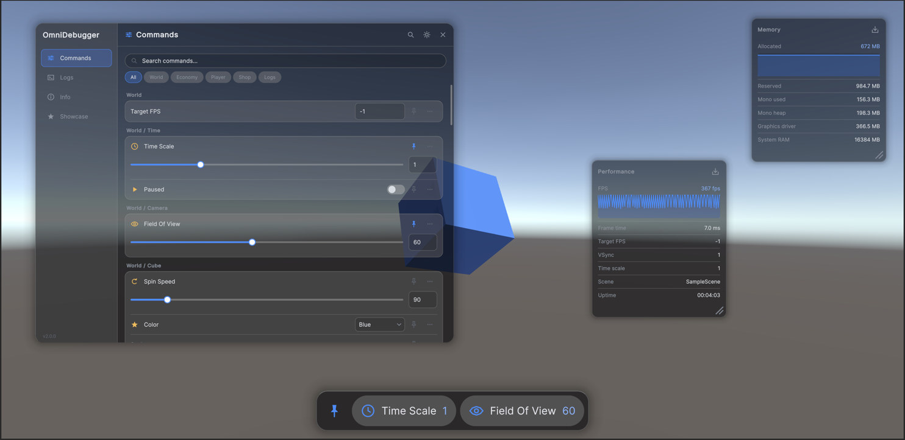
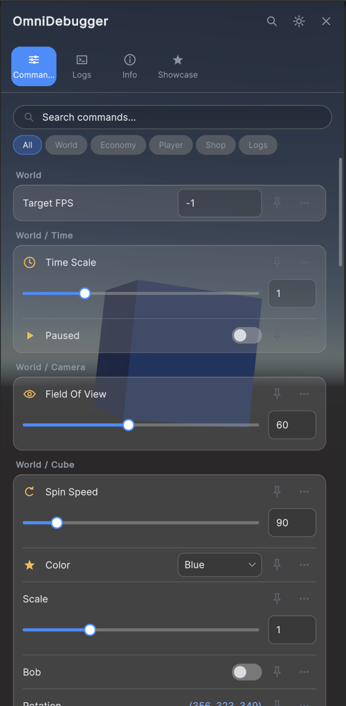
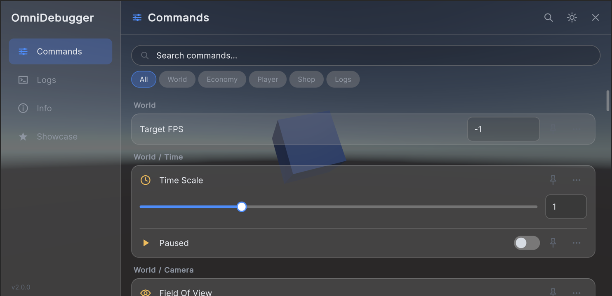
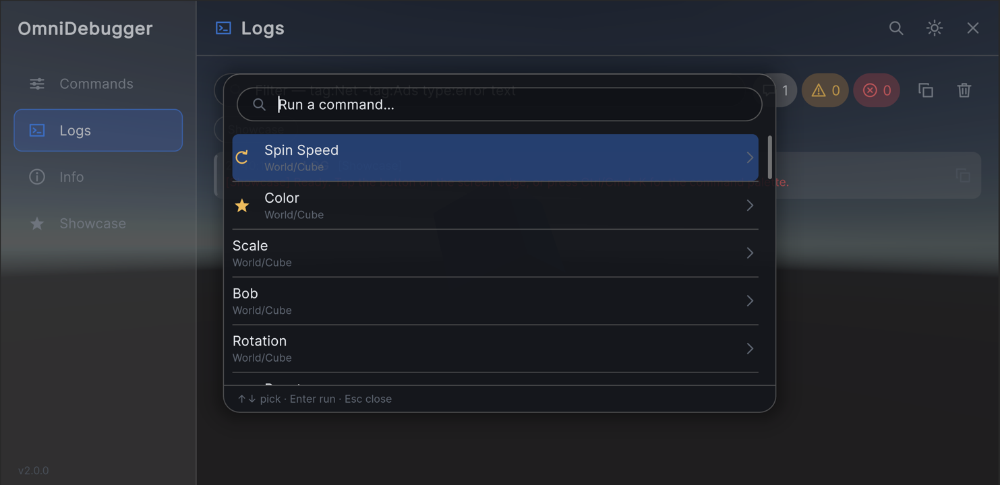
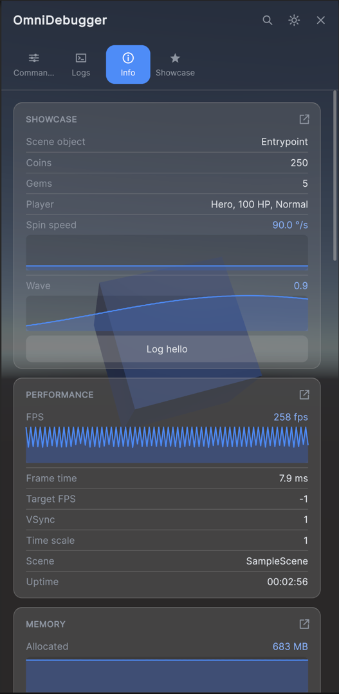
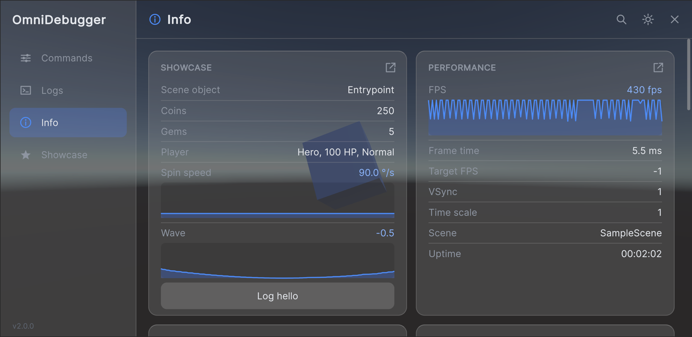

# OmniDebugger
[](https://unity.com/releases/editor/archive)

[](https://www.donationalerts.com/r/danilchizhikov)

## Overview
OmniDebugger is a runtime cheat and debug panel for Unity. It is built on UI Toolkit, so it draws on top of any
project without pulling in uGUI, TextMeshPro, or any other dependency.



Annotate a method or a property, hand the object over, and it becomes a debug command you can run by its path:

```csharp
[DebugCommand("Economy/Coins", Name = "Add Coins", Description = "Adds coins to the wallet.")]
[DebugTags("money", "wallet"), DebugIcon("coin")]
public void AddCoins(int amount = 100) => _wallet.Coins += amount;
```

Then hand it to a debugger. A source generator has already turned the attribute into registration code, so nothing
is read through reflection and nothing has to be kept from the IL2CPP linker. In play mode the debugger puts the
panel on screen itself, and `Window → DTech → OmniDebugger` shows the commands in the editor's own controls:

```csharp
_debugger = new OmniDebuggerHost();
_debugger.Commands.Register(this);
```

Commands that do not live on a class of yours are built in code:

```csharp
_debugger.Commands.Build()
    .Group("World/Time")
        .Slider("Time Scale", () => Time.timeScale, value => Time.timeScale = value, 0f, 4f, step: 0.25f)
        .Button("Pause", () => Time.timeScale = 0f)
    .Register();
```

## Table of Contents
- [Getting Started](#getting-started)
    - [Prerequisites](#prerequisites)
    - [Manual Installation](#manual-installation)
    - [UPM Installation](#upm-installation)
- [Enabling the Debugger](#enabling-the-debugger)
- [Usage](#usage)
    - [Declaring Commands](#declaring-commands)
    - [Commands Without Attributes](#commands-without-attributes)
    - [Running Commands](#running-commands)
    - [Searching](#searching)
    - [Reading the Log](#reading-the-log)
- [The Panel](#the-panel)
    - [At Runtime](#at-runtime)
    - [Opening It](#opening-it)
    - [Locking It](#locking-it)
    - [Tabs](#tabs)
    - [The Hotbar](#the-hotbar)
    - [Floating Sections](#floating-sections)
    - [Command Icons](#command-icons)
    - [In the Editor](#in-the-editor)
- [Themes](#themes)
- [Extending the Panel](#extending-the-panel)
    - [Your Own Tab](#your-own-tab)
    - [Your Own Info](#your-own-info)
    - [Your Own Argument Field](#your-own-argument-field)
    - [Your Own Icons](#your-own-icons)
    - [Your Own Way In](#your-own-way-in)
    - [Your Own Mount](#your-own-mount)
    - [Styling and Redrawing](#styling-and-redrawing)
- [Code Stripping](#code-stripping)
- [Support](#support)
- [License](#license)

## Getting Started

### Prerequisites
- [GIT](https://git-scm.com/downloads)
- [Unity](https://unity.com/releases/editor/archive) 6000.0+

### Manual Installation
1. Download the .unitypackage from the [releases](https://github.com/DanilChizhikov/OmniDebugger/releases/) page.
2. Import com.dtech.omnidebugger.x.x.x.unitypackage into your project.

### UPM Installation
1. Open the manifest.json file in your project's Packages folder.
2. Add the following line to the dependencies section:
    ```json
    "com.dtech.omnidebugger": "https://github.com/DanilChizhikov/OmniDebugger.git",
    ```
3. Unity will automatically import the package.

If you want to set a target version, OmniDebugger uses the `v*.*.*` release tag so you can specify a version like #v1.0.0.

For example `https://github.com/DanilChizhikov/OmniDebugger.git#v2.0.0`.

## Enabling the Debugger

The runtime assembly is gated behind the `OMNI_DEBUGGER` scripting define. Without it the assembly is not
compiled at all, so a shipping build carries none of it — no stripped-down stub, no no-op calls, nothing.

Turn it on per build target in **Project Settings → DTech → OmniDebugger**. Because the define may be on for
one platform and off for another, and off entirely in a release build, **your own calls into OmniDebugger belong
inside `#if OMNI_DEBUGGER`**:

```csharp
#if OMNI_DEBUGGER
private OmniDebuggerHost _debugger;
#endif

private void Awake()
{
#if OMNI_DEBUGGER
    _debugger = new OmniDebuggerHost();
    _debugger.Commands.Register(this);
    _debugger.Groups.SetOrder("Economy", 10);
#endif
}

private void OnDestroy()
{
#if OMNI_DEBUGGER
    _debugger?.Dispose();
#endif
}
```

That debugger is yours: you construct it, you hold it, and you dispose it. Disposing releases every registered
object — MonoBehaviours included — and clears every registry's subscribers.

Or leave the lifetime to the package and read `OmniDebuggerHost.Shared`. It hands out the first debugger built and not
disposed yet, and while there is none it builds one from the project settings right there, so any script reaches
the same debugger without passing it around:

```csharp
#if OMNI_DEBUGGER
private void OnEnable() => OmniDebuggerHost.Shared.Commands.Register(this);

private void OnDisable()
{
    if (OmniDebuggerHost.TryGetShared(out OmniDebuggerHost debugger))
    {
        debugger.Commands.Unregister(this);
    }
}
#endif
```

`TryGetShared` reads the slot without building anything, which is what teardown code wants. A debugger `Shared`
built itself is disposed by the package once play mode is over in the editor; one your code built stays yours to
dispose, and a debugger built next to it never replaces it. Turn on *Create On Startup* (see
[At Runtime](#at-runtime)) to have the shared debugger built before the first scene loads.

## Usage

### Declaring Commands

Put `[DebugCommand(groupPath)]` on a **public or internal instance** member. The group path nests as deep as you like
— `"Economy"`, `"Economy/Coins"`, `"Cheats/World/Weather"` — and the command's own name is the last segment of its
path. Named arguments: `Name` (defaults to the member name), `Order` (lower comes first within the group) and
`Description`. `[DebugTags]` adds extra phrases the command can be searched by, and `[DebugIcon]` gives it an icon
(see [Command Icons](#command-icons)).

| Member | Becomes | Notes |
|---|---|---|
| `void` method | `CommandKind.Action` | One argument per parameter; optional parameters stay optional |
| property with an accessible get **and** set | `CommandKind.Value` | Running it writes the value |
| property with an accessible get only | `CommandKind.ReadonlyValue` | A private or `init` setter counts as read-only |

OmniDebugger ships a Roslyn source generator (`Runtime/Analyzers`) that reads these attributes while Unity compiles
your scripts and writes the code that turns an instance into commands — direct calls, no reflection. Every assembly
that references OmniDebugger gets it. A member that cannot be a command is a **compile error** naming the member and
the reason, so a rejected command is never silently missing:

| Id | Reason |
|---|---|
| `OMNI001` | The member is static — a command runs against the instance you register |
| `OMNI002` | The member is private or protected |
| `OMNI003` | The method returns a value — use a property to report one |
| `OMNI004` | The method is generic |
| `OMNI005` | A parameter is `ref`, `out`, `in`, a pointer or a ref struct |
| `OMNI006` | The property has no accessible getter |
| `OMNI007` | The property is an indexer |
| `OMNI008` | The declaring type, or one it is nested in, is private or protected |
| `OMNI009` | The declaring type is generic |
| `OMNI010` | The declaring type is not a class |
| `OMNI011` | `[DebugRange]` has bounds the wrong way round, or a negative step |
| `OMNI012` | The group path is blank |
| `OMNI013` | The name is blank or contains `/` |

Arguments accept anything `IConvertible` (all numerics, `bool`, `char`, `string`, `DateTime`), any `enum`, and
`Nullable<T>` of those. Text is always read with the invariant culture, so a device locale can never turn `"1.5"`
into `15`.

`[DebugRange(min, max)]` on a numeric property or parameter turns its field into a slider with a value box, and
`Step` snaps it:

```csharp
[DebugCommand("World", Name = "Time Scale"), DebugRange(0, 4, Step = 0.25)]
public float TimeScale { get => Time.timeScale; set => Time.timeScale = value; }

[DebugCommand("World")]
public void Teleport([DebugRange(-100, 100)] int x, [DebugRange(-100, 100)] int y) { … }
```

A range is a hint for the panel, which keeps what is typed inside it; code that runs the command is not held to it.
It covers `int`, `short`, `ushort`, `byte`, `sbyte`, `float` and `double` — other types keep a plain field.

The panel lists groups by their order, then by name, at every level of the tree. `debugger.Groups.SetOrder("Economy", 10)`
moves a group up — lower comes first, and a group never given an order sits at 1000
(`CommandDefinition.DefaultSortOrder`). `SetOrder("Economy/Coins", 5)` orders a subgroup among its siblings. Inside a
group, its own commands come first, by their `Order` and then by name, then its subgroups.

Registration is always explicit. Nothing scans your assemblies:

```csharp
IDisposable registration = _debugger.Commands.Register(myShopService);
registration.Dispose();                           // removes exactly what that call added
_debugger.Commands.Unregister(myShopService);     // the same, when the handle is not at hand
```

`Register` includes the commands a base class declares. It holds the object until the handle is disposed,
`Unregister` is called or the debugger is disposed. Registering the same object twice is ignored with a warning; a
second object of the same type collides on every path and is left out with an error per command, since paths have
to be unique.

### Commands Without Attributes

For commands built at runtime, or on a type you do not own, describe them fluently and register them in one go:

```csharp
IDisposable cheats = _debugger.Commands.Build()
    .Group("Economy/Coins")
        .Button("Add 1000", () => _wallet.Add(1000))
        .Button<int>("Add", amount => _wallet.Add(amount), a => a.Name("amount").Default(100).Range(0, 10_000))
        .Toggle("Infinite", () => _wallet.Infinite, value => _wallet.Infinite = value)
        .Value("Balance", () => _wallet.Coins).Icon("coin")
    .Group("World")
        .Slider("Time Scale", () => Time.timeScale, value => Time.timeScale = value, 0f, 4f, step: 0.25f)
        .Dropdown("Weather", () => _weather, value => _weather = value)
        .Field("Seed", () => _seed, value => _seed = value)
    .Register();

cheats.Dispose();   // takes the whole batch away again
```

| Method | Becomes |
|---|---|
| `Group(path)` | Puts the commands that follow in that group |
| `Button(name, action)` | An action; `Button<T>`, `Button<T1, T2>` and `Button<T1, T2, T3>` take arguments, each described by an `ArgumentBuilder` (`Name`, `Default`, `Optional`, `Range`, `Step`) |
| `Toggle(name, get, set)` | A switch bound to a `bool` |
| `Slider(name, get, set, min, max, step)` | A slider bound to a `float` or an `int` |
| `Dropdown<TEnum>(name, get, set)` | A dropdown bound to an enum |
| `Field<T>(name, get, set)` | A value edited with whatever control fits `T` |
| `Value<T>(name, get)` | A read-only value, shown live |
| `Icon`, `Tags`, `Description`, `Order` | Describe the command added last |

A builder registers once. Commands from anywhere else — generated from data, say — are `DebugCommand` objects: a
`CommandDefinition` plus the delegates that run it. `_debugger.Commands.Add(commands)` registers a list of them and
returns the same kind of handle:

```csharp
List<DebugCommand> items = new List<DebugCommand>();

foreach (Item item in _shop.Catalog)
{
    items.Add(new DebugCommand(
        new CommandDefinition($"Give {item.Name}", "Shop/Items", CommandKind.Action),
        invoke: _ => _shop.Give(item)));
}

_debugger.Commands.Add(items);
```

The constructor checks the delegates against the definition's `CommandKind` and throws `ArgumentException` on a
mismatch: an action needs `invoke`, a value `get` and `set`, a read-only value `get`. A value's definition carries
exactly one `ArgumentDefinition` describing it — its type picks the panel's control and the type the setter receives.

### Running Commands

Commands are addressed by their path, `"Group/Subgroup/Name"`, so it can be typed into a console or stored in a
config.

```csharp
_debugger.Commands.TryExecute("Economy/Coins/Add", 500);
_debugger.Commands.TryExecute("Economy/Coins/Add", "500");                               // text is coerced
_debugger.Commands.TryExecute("Economy/Coins/Add", InvocationRequest.From("Console", 500)); // names who asked
_debugger.Commands.TryGetValue("Economy/Coins/Balance", out object coins);
```

`TryExecute` returns `false` and logs the reason when the command is missing, is not runnable, gets arguments it
cannot bind, or throws. A command that throws never escapes into the caller. A null or blank path is the one case
that is not a `false`: it throws `ArgumentException`, because an empty path is a bug in the caller rather than a
command that failed. Paths are normalized, so `" Economy / Coins /Add "` finds the same command.

Every invocation is logged *before* it runs — a command that hard-kills the process still leaves a record of what
did it.

What is registered is readable the same way: `All` is an `IReadOnlyList<CommandDefinition>` snapshot and `TryGet`
looks one up by path. `CommandPath` builds and splits paths (`Combine`, `GetParent`, `GetName`, `Split`,
`Normalize`).

```csharp
_debugger.Commands.OnChanged += Refresh;   // fires after every registration and removal
```

`OnChanged` is what a panel — or a search index — hangs off of, since registration can happen at any point in a
session. Disposing the debugger drops every subscriber along with the commands.

`ICommandRegistry` and `IGroupOrder` are main-thread only and throw `InvalidOperationException` when called from
anywhere else, rather than quietly doing nothing.

### Searching

`SearchIndex<T>` finds anything implementing `ISearchIndexable`, which `CommandDefinition` does. Items sit behind
an inverted index, so a query reads the words that were typed and the items those words belong to — never the
whole catalog.

```csharp
SearchIndex<CommandDefinition> index = new SearchIndex<CommandDefinition>();
index.Rebuild(_debugger.Commands.All);             // re-index when the commands change

SearchSession<CommandDefinition> session = index.BeginQuery(_field.value, default);
session.OnUpdated += Repaint;                       // hits are republished after each stage

// Drive it with whatever slice of the frame you can spare.
session.Advance(budgetTicks: Stopwatch.Frequency / 2000);   // ~0.5 ms

foreach (SearchHit hit in session.Hits)
{
    CommandDefinition command = index[hit.Id];      // a hit is an id, a score, and the stage that found it
}
```

A hit does not carry the item — `SearchHit` is `Id`, `Score`, and `Stage`, and the indexer turns the id back into
what you put in. Ids are stable for the life of an entry and are never handed out twice, so one can be held across
frames; `index.Count` is how many entries are live.

An index keeps a single session. `BeginQuery` restarts the one it owns, so a second call replaces the query that
was running rather than starting a second one — which is what a panel that re-queries on every keystroke wants,
and why the returned session should not be stored beyond the current query.

Work is handed out in slices the caller pays for, so a search never owns a frame. Stages run cheapest first —
`SearchStage.Exact` (whole word), `Prefix`, `Infix` (substring), then `Fuzzy` (near-miss) — and `session.Hits` is
rebuilt after each one, best first. The first slices already hold what a person is most likely to want, while the
expensive near-miss work is still outstanding; `session.Stage` says what is being worked on and
`session.IsComplete` says when there is nothing left. `hit.Stage` is how good a match it was, so it also reads as
"exact matches above guesses".

`Advance` takes a budget in `Stopwatch` ticks and returns `true` while work remains. A budget of zero still does
one unit of work, so too small a slice cannot livelock the caller. To spend a budget per frame without writing the
loop, `await session.RunAsync(budgetTicks, cancellationToken)`; `session.Cancel()` stops a query where it stands
and leaves `Hits` readable.

A command is indexed by its name, every segment of its group path and its tags. Each phrase is indexed as its own words, as the words run together, and as their initials, so *Add Coins* is
found by `"coins"`, `"add coins"`, `"addcoins"` and `"ac"` alike. Run-together names are split on camel humps and
where letters meet digits. Near-miss matching uses edit distance, so `"coibs"` still finds *Add Coins*. Every
extra word narrows the result rather than widening it.

`QuerySettings` caps how many hits are kept and can turn stages off (`SearchOptions.ExactOnly`,
`SearchOptions.NoFuzzy`) or demand matching letter case (`SearchOptions.CaseSensitive`). An empty term completes
immediately with no hits — read that as "show everything".

For a large set, `RebuildAsync` gathers phrases on the main thread and builds the index on a worker, swapping it
in when it is ready; queries keep answering from the previous index until then. `Add` and `Remove` keep
single-item changes cheap, and the index folds them into the bulk data on its own once they add up. `Clear` empties
it without throwing the index away, and `Dispose` retires it for good — every call after that throws
`ObjectDisposedException`.

Like the catalog, the index is main-thread only, `RebuildAsync`'s worker excepted, and says so by throwing rather
than by misbehaving quietly.

### Reading the Log

`debugger.Logs` (`ILogFeed`) is Unity's console as the debugger captured it — the same records the Logs tab shows,
readable from code and from any thread. A query reads one page at a time:

```csharp
List<LogRecord> page = new List<LogRecord>();
LogQuery query = LogQuery.Parse("tag:Net type:warning type:error", limit: 20);

bool hasOlder = _debugger.Logs.Query(query, page);   // the newest 20 matches, oldest first
long newest = page.Count > 0 ? page[page.Count - 1].Id : 0;

// Later: only what arrived since. Before(page[0].Id) pages the other way, towards older records.
page.Clear();
_debugger.Logs.Query(query.After(newest), page);
```

`Query` appends to the list it is given and returns `true` while more matches lie beyond the page, in the direction
it grew. Record ids only grow, so an id is a safe bookmark. The default `LogQuery` matches everything; its parts are:

| Part | Matches |
|---|---|
| `Text` | Every word, in the message or the stack trace, ignoring case; a phrase in double quotes as written |
| `Tags` | Records carrying any of these tags, ignoring case |
| `ExcludedTags` | Leaves out records carrying any of these tags |
| `Types` | `LogTypeMask.Log`, `Warning`, `Error` (asserts and exceptions count as errors) |
| `Limit` | Records per page, 64 by default |

`LogQuery.Parse` reads the syntax the Logs tab's filter bar takes: `tag:Net -tag:Ads type:error timeout "no route"`.
Several `tag:` or `type:` terms match any of them; different kinds of term, and the words of the text, all have to
match. Values can be quoted, `tag:"Game Loop"`, and anything it does not recognise is text.

A message has tags when it starts with `[Tag]` prefixes — `"[Net] [Auth] failed"` carries `Net` and `Auth` — or when
it was logged through `Debug.unityLogger.Log("Net", "failed")`, which Unity writes as `"Net: failed"`. (An exception's
message reads `"NullReferenceException: …"` too, so exceptions never get a tag that way.)

A message repeated back to back — the same text, stack trace and type — is folded into the record before it rather
than stored again: `LogRecord.RepeatCount` says how many times it arrived and `LastTimestampUtc` when it last did, so
a message logged every frame takes one record. `LogRecord.Flags` says whether the message or the stack trace was cut
to fit (`LogFlags.MessageTruncated`, `StackTraceTruncated`).

`Version` grows with every record, every repeat and every `Clear`, which makes it a cheap "anything new?" check.
`ErrorCount` counts errors, asserts and exceptions since the debugger was built, repeats included, and never goes
down, not even on `Clear`. `CountByType` and `GetKnownTags` report what is kept right now.

## The Panel

The panel is one view (`OmniDebuggerView`) mounted over the running game. The editor has a window of its own, built
from the editor's own controls — see [In the Editor](#in-the-editor).

The panel saves on the device the theme, the hotbar, the arguments last typed for each command, which Info sections
float and how big each one is, and where the open button was dragged to. The open tab, group and search, and where a floating panel
was moved to, survive the panel being rebuilt, but not a restart.

What the panel shows follows the game on its own. While a row is on screen — in the Commands tab, on the hotbar or in
an Info section — its value is re-read four times a second: a read-only value, and the control of a property
too, so a property your code changes moves its switch, slider or field. A control being edited is left alone until
the edit is committed or undone. When that is not soon enough, or after a change only a redraw picks up — an icon
registered late, a tab of your own — ask for a redraw:

```csharp
OmniDebuggerHost.Shared.Refresh();   // every view of this debugger: the panel, the hotbar, floating sections
```

Calls made within one frame are merged into one redraw. The selected tab gets `IOmniDebuggerTab.Refresh`, and
`IOmniDebuggerHost.OnRefreshRequested` reaches content of your own, such as an element in an Info section — see
[Styling and Redrawing](#styling-and-redrawing).

### At Runtime

Constructing the debugger in play mode is all it takes. It builds the panel, the open button and the log capture
itself, and takes them down again on `Dispose`:

```csharp
#if OMNI_DEBUGGER
private OmniDebuggerHost _debugger;

private void Awake()
{
    _debugger = new OmniDebuggerHost();
    _debugger.Commands.Register(this);
}

private void OnDestroy() => _debugger?.Dispose();
#endif
```

With *Create On Startup* on, not even that is needed: the package builds `OmniDebuggerHost.Shared` before the first
scene loads, so the log is captured from the very first frame and the panel is there without a line of code.
Scripts register their commands through `OmniDebuggerHost.Shared`. A debugger built with `new` next to it puts a second
panel on screen, and says so in the console.

How it looks and opens is set in **Project Settings → DTech → OmniDebugger → Panel**. The page shows up while
`OMNI_DEBUGGER` is on for the active build target:

| Section | Options |
|---|---|
| Startup | `CreateOnStartup`, `CreatePanel`, `OpenOnStart` |
| Layout, Scaling and Layering | `LandscapeLayout`, `FloatingScale`, `HotbarEdge`, `ScaleMode`, `Scale`, `SortingOrder`, `PanelSettings` (left empty, the shipped asset is cloned, never edited) |
| Open Button | `ButtonEnabled` (*Open Button Enabled*), `ButtonClicks`, `MultiClickWindow`, `ButtonAnchor`, `ButtonOpacity` |
| Shortcuts | `Shortcuts` |
| Lock | `Lock` — see [Locking It](#locking-it) |
| Themes | `DefaultTheme`, extra `Themes` |

In code, `CreateOnStartup`, `CreatePanel`, `DefaultTheme` and `Themes` sit on `OmniDebuggerOptions`;
everything else sits on `OmniDebuggerOptions.Panel` (`OmniDebuggerPanelOptions`), with the button and the shortcuts
under `Panel.Open` and the lock under `Panel.Lock`.

The settings live in `ProjectSettings/OmniDebuggerSettings.asset`: versioned with the project, nothing added to
`Assets`. Play mode reads them live: a debugger built without options in code, and its panel, pick up every edit
made on the page while the game runs. A build gets a snapshot — right before it
starts, the settings are written to a generated `Resources` asset, which is deleted again once the build is done.
That only happens while `OMNI_DEBUGGER` is on for the target, so a release build carries neither the settings nor
the themes and panel settings they point at.

`new OmniDebuggerHost()` reads these settings, and so does `OmniDebuggerOptions.Default`, which hands out a copy — change
a few values in code and pass it on:

```csharp
OmniDebuggerOptions options = OmniDebuggerOptions.Default;       // the project settings, copied
options.Panel.Open.Shortcuts.Add(new OmniDebuggerShortcut(KeyCode.LeftControl, KeyCode.BackQuote));

_debugger = new OmniDebuggerHost(options);
```

Options passed to the debugger replace the project settings as a whole — later edits to the page no longer reach it;
`new OmniDebuggerOptions()` starts from the package's built-in defaults instead.

Set `CreatePanel = false` to build the panel yourself instead: drop `OmniDebuggerPanel` on a GameObject and call
`Bind(debugger)`, or let `OmniDebuggerPanel.Create(debugger, panelOptions)` make one on an object that survives scene
loads. The component has no options of its own — it reads the same project settings, and code can change
`panel.Options` before binding. Its `UIDocument` is optional: leave it empty and one is created. `Unbind()` tears the
panel down and leaves the component ready for another debugger. The panel a debugger built itself is
`OmniDebuggerHost.Panel` — null with `CreatePanel` off or outside play mode. To put the panel into UI of your own
rather than over the game, see [Your Own Mount](#your-own-mount).

**Scaling.** Every size is written for a portrait phone 360 units wide. `ScreenSize` scales that with the screen,
so the panel looks the same on every phone and leans towards the height in landscape instead of tripling in size.
`PhysicalSize` reads the same units as desktop pixels at 96 DPI. `Auto`, the default, picks `ScreenSize` on mobile
platforms and `PhysicalSize` elsewhere. `OmniDebuggerPanel.SetScale` changes it on the spot.

**Layout.** Held upright, the panel is a glass sheet edge to edge, with the tabs in a strip along the top. Turned
sideways, the tabs move into a sidebar and the panel becomes a floating window over the game, no bigger than
296 × 227 units at the default floating scale — or runs edge to edge with *Landscape Layout* set to *Full Screen*
(Panel settings → *Layout, Scaling and Layering*, `LandscapeLayout`). The game stays live around a floating panel: a
tap beside it reaches the game and never closes the panel — × or a shortcut does. Drag the window by its top bar to
move it; it stays on screen and keeps its place for the session. *Floating Scale* (`FloatingScale`, 1 by default — a
compact window with smaller text than edge to edge) shrinks or grows it on top of the panel's own scaling, never past
the screen. Info sections switch to two columns once there is room. The panel keeps out of the notch and the home
indicator; edge to edge, its glass reaches under the notch while the content stays clear of it.

<table>
  <tr>
    <td rowspan="2" align="center">
      <br>
      <sub>Portrait</sub>
    </td>
    <td align="center">
      <br>
      <sub>Landscape, floating</sub>
    </td>
  </tr>
  <tr>
    <td align="center">
      <br>
      <sub>Landscape, <i>Full Screen</i></sub>
    </td>
  </tr>
</table>

**Input after an EventSystem is rebuilt.** With uGUI in the project, UI Toolkit routes taps through an object Unity
parents under the EventSystem. The panel owns that object itself and re-asserts it every frame, so destroying the
EventSystem and creating a new one does not leave it deaf to taps.

### Opening It

| Way in | Configured by |
|---|---|
| The floating button — tap it, or tap it `ButtonClicks` times in a row | Panel settings → *Open Button* (`Open.ButtonEnabled`, `Open.ButtonClicks`, `Open.MultiClickWindow`, `Open.ButtonAnchor`, `Open.ButtonOpacity`) |
| A keyboard shortcut — one key, or a chord that fires when its last key goes down; each toggles the panel | Panel settings → *Shortcuts* (`Open.Shortcuts`) |
| The command palette — Ctrl+K, or Cmd+K on a Mac, opens the panel with a search box over it | Always on; the magnifier in the panel's header opens it on a touch screen |
| Code | `OmniDebuggerPanel.Open()` / `Close()` / `Toggle()` |
| A gesture of your own in place of the button | `OmniDebuggerPanel.SetGesture` — see [Your Own Way In](#your-own-way-in) |

The button is a small glass square. It starts at the corner or edge `ButtonAnchor` names, at `ButtonOpacity`
(0.5 by default), and lights up — full opacity, accent ring and glow — on every tap, so a series of taps shows each
one landed. Drag it straight away, no hold needed, and let go: it glides to the nearest edge of the screen and sticks
there, inside the safe area, across restarts too (saved in `PlayerPrefs`) until `ButtonAnchor` changes. Errors logged
while the panel is closed show as a red badge on its corner counting them (up to 99+); opening the panel clears it.
Hide the button at runtime with `SetOpenButtonEnabled(false)`, or replace it with `SetGesture(IOmniDebuggerGesture)`
(see [Your Own Way In](#your-own-way-in)).

**The command palette.** Ctrl+K (Cmd+K) opens a search box over the panel, opening the panel first when it is closed.
With nothing typed it lists the hotbar, then the rest. ↑ and ↓ pick a result and Enter runs it: an action with the
arguments last typed for it or their defaults, a switch flipped. A command that needs a value typed opens in the
Commands tab instead, scrolled to and lit up. Esc closes the palette. It goes through the [lock](#locking-it) like every
other way in.



To bind a shortcut, press *Add Shortcut*, click the new field, hold the keys and release them; `Esc` cancels and `×`
removes the row. Shortcuts are `KeyCode`s whichever input backend runs: the Input System package is used when it is
installed and active, the legacy Input Manager otherwise. Shift, Ctrl, Alt and Cmd/Win match either side of the
keyboard. Nothing is required: with neither backend, shortcuts stay silent and the button still works.

### Locking It

Panel settings → *Lock* makes the runtime panel ask for a PIN or a password before it shows. Every way in — the
button, a shortcut, `Open()` and *Open On Start* — goes through the prompt; the editor window never asks.

| Option | What it does |
|---|---|
| `Lock.Mode` | `None`, `Pin` — 4 to 12 digits on the panel's own keypad (a hardware keyboard types too), or `Password` — any characters in a masked field |
| *New PIN / New Password* → *Set* | Stores a salted SHA-256 hash of what was typed; *Clear* forgets it. From code: `Lock.SetSecret("1234")` / `Lock.ClearSecret()` |
| `Lock.UnlockScope` | `EveryOpen` asks each time, `Session` once until the app restarts, `Device` once on this device until the secret changes |
| `Lock.SkipInEditor` | On by default: play mode in the editor opens without asking |
| `Lock.MaxAttempts` / `Lock.CooldownSeconds` | After 5 wrong entries in a row the prompt pauses for 30 seconds; 0 attempts never pauses |

Neither the project settings nor a build hold the secret itself, only its hash. That keeps testers and players from
wandering in, not a determined attacker: the hash ships with the build, and a short PIN is quick to guess from it.
With a mode picked but no secret set, the panel opens without asking and the settings page warns about it.

### Tabs

| Tab | What it does |
|---|---|
| **Commands** | Every command in one list. A search box on top finds commands by name, group or tag. Under it, a chip per top-level group filters the list; picking one shows the way back up and the groups inside it, and the list below is headed by subgroup. Each command is a row — icon, name and its control: a switch for a `bool`, a slider for a ranged number, a field, a dropdown, a ▶ that runs it (arguments beside it or under it), or a read-only value. Values and property controls follow the game live. The pin puts the command on the [hotbar](#the-hotbar); *⋯* shows its path, tags and description |
| **Logs** | Unity's console, captured since the debugger was built: type toggles with counts, a filter bar that takes the [filter syntax](#reading-the-log) — `tag:Net -tag:Ads type:error timeout` — with the terms in use as chips that take themselves out when tapped and a chip per known tag that adds it, copy one or everything, clear. A message repeated back to back is one row with a ×N badge. It follows new logs while scrolled to the bottom and loads older ones at the top |
| **Info** | A section per [info provider](#your-own-info): Performance (an FPS chart, frame time, target frame rate, VSync, time scale, scene, uptime), Memory (an allocated-memory chart, reserved, Mono and graphics memory), Graphics, Quality, Screen, Build and Device |

The header holds the search that opens the [palette](#opening-it), the theme switch and ×. What is typed into a command's arguments
is remembered per command and saved on the device, so a command run with 500 offers 500 again after a restart. The
captured log is also readable in code through `debugger.Logs` (`ILogFeed`) — see [Reading the Log](#reading-the-log).
Tabs of your own sit next to these, and any of these can be dropped — see [Your Own Tab](#your-own-tab).

<table>
  <tr>
    <td align="center">
      <br>
      <sub>Info, portrait</sub>
    </td>
    <td align="center">
      <br>
      <sub>Info, landscape — two columns</sub>
    </td>
  </tr>
</table>

The log keeps up to 16 384 records within a budget of about 4 million characters of text (some 8 MB), dropping the
oldest first. A message repeated word for word is stored once and shared by its records — back to back, it is one
record — so repeats cost a record at most and no text, and a filter reads each distinct message once.

### The Hotbar

The hotbar is a strip of the commands you pinned, along the bottom of the screen — or the top, with *Hotbar Edge*
(`OmniDebuggerPanelOptions.HotbarEdge`) — over the game while the panel is closed or floating. Pin a command with the
pin on its row, in the editor window's inspector, or from code:

```csharp
debugger.Hotbar.Pin("Economy/Coins/Add 1000");
debugger.Hotbar.Unpin("World/Time Scale");
```

A tap runs an action — with the arguments last typed for it, or their defaults — or flips a switch; the value of a
property or a read-only value shows beside its name. A command that needs a value typed, or a long press on any of
them, opens its full row in a popup, where it can be edited or unpinned. The pin at the strip's start folds it into a
small tab with a count, and the fold is remembered. `IHotbar` also offers `Paths` (in order), `Contains`, `Toggle`,
`Move`, `Clear` and `OnChanged`. The list is saved on the device; a path whose command is not registered stays pinned
and shows up again once it is.

### Floating Sections

Any section of the Info tab can float over the game — the FPS chart while you play, or a section of your own with a
few commands to hit. The button at the top right of a section floats it; the same button, or the one on the floating
card, takes it back. A floating section is still in the Info tab too.

Floating sections show while the panel is closed and next to a floating panel while it is open; an edge-to-edge
panel hides them until it closes. New ones line up down the right side of the screen. Drag one by its title; whichever
was touched last, the panel or a card, is on top. A card starts at half the size of the section in the tab; the grip
in its bottom right corner scales that card alone, from half to three times that. Which sections float and the scale of each are saved on the device; where a card was dragged to lasts as long
as the panel. From code, and for sections of your own, see [Floating a Section](#floating-a-section).

### Command Icons

```csharp
[DebugCommand("Economy"), DebugIcon("coin")]           // a built-in glyph
public void AddCoins(int amount) { … }

[DebugCommand("Economy"), DebugIcon("Icons/Gem")]      // anything else: loaded by the icon provider
public void AddGems(int amount) { … }
```

A key is first read as the name of a built-in vector glyph, drawn by the panel in the text colour at any size and
needing no asset: `bolt`, `bug`, `chart`, `check`, `clock`, `coin`, `copy`, `error`, `eye`, `filter`, `flag`, `gear`,
`grid`, `heart`, `info`, `keyboard`, `message`, `moon`, `pin`, `play`, `refresh`, `search`, `sliders`, `star`, `sun`,
`terminal`, `trash`, `user`, `warning`, `window` and a few more — `OmniGlyphs.Names` lists them all. Any other key goes
to the icon provider; the default one loads a sprite, or a texture, from that path in a `Resources` folder. The same
keys work for `CommandBuilder.Icon` and a tab's `Icon`. To serve icons from anywhere else, see
[Your Own Icons](#your-own-icons).

### In the Editor

`Window → DTech → OmniDebugger` shows the newest live debugger in the editor's own controls — every
`OmniDebuggerHost` announces itself on construction; with none alive the window offers to enter play mode.

- **Commands** — a tree built from the command paths on the left, with a search field over the window (Ctrl+K or
  Cmd+K focuses it) that narrows the tree to the matches. The inspector on the right shows the selected command: its
  path, kind, tags and description, a native control for its value — a toggle, a number field or a slider for a
  range, an enum popup, a text field — or its arguments with a *Run* button, and *Pin to hotbar*, which pins it on
  the game's hotbar. Values follow the game four times a second. Selecting a group shows every command in it.
- **Info** — the debugger's [info sections](#your-own-info) as foldouts, charts included.

The window remembers per user, in the editor's preferences, which view was open, the tree's width, what was selected
and unfolded, and the arguments typed into it — kept apart from the game's, which live in `PlayerPrefs`. An argument
type the editor has no control for gets the field `debugger.Fields` builds for it.

## Themes

A theme is an `OmniDebuggerTheme` asset holding an ordered list of plain `.uss` sheets. The panel applies its own
skin first, then a complete set of dark tokens, then your sheets — last, so your values win. Because the token
set underneath is always complete, a theme that redefines one variable is perfectly valid.

```css
/* Assets/UI/OceanTheme.uss */
.od-root {
    --od-color-glass: rgba(15, 23, 36, 0.86);         /* the panel over the game */
    --od-color-bg: rgb(15, 23, 36);                   /* the panel mounted opaque, without glass */
    --od-color-card: rgba(56, 189, 248, 0.05);
    --od-color-text: rgb(226, 236, 248);
    --od-color-accent: rgb(56, 189, 248);
    --od-color-glow: rgba(56, 189, 248, 0.38);
    --od-color-control-selected: rgba(56, 189, 248, 0.16);
    --od-radius-lg: 10px;
}
```

1. **Create → DTech → OmniDebugger → Theme**, name it, drag the `.uss` into *Style Sheets*.
2. Set it as *Default Theme* or list it under *Themes* in the Panel settings, or call
   `debugger.Themes.Register(theme)`.
3. The panel's theme switcher offers it. No code.

What the switcher offers depends on what is set:

| Set | Themes offered | Switcher |
|---|---|---|
| Nothing | built-in Dark and Light | one button toggling the two |
| *Default Theme* only | that theme alone | hidden |
| *Themes* (or `Register`), with or without *Default Theme* | built-in Dark and Light, the listed ones and the default | dropdown, starting from *Default Theme* |

Every colour, spacing, radius, font size and metric the panel draws with is a `--od-*` variable; the full list is
in `Runtime/UI/Resources/OmniDebugger/OmniDebuggerTokensDark.uss`. Want a light base? List the package's
`OmniDebuggerTokensLight.uss` first in your theme, then your own sheet.

The built-in palettes are Glass + Electric Blue, dark and light. UI Toolkit has no backdrop blur, so the glass is
layered: a translucent panel (`--od-color-glass`) with a lighter top edge, tiles washed faintly over it, fields
sunk into darker wells, and one accent (`--od-color-accent`) kept for what is selected, on or runnable. Soft
glows and shadows are drawn by the panel itself in `--od-color-glow` and `--od-color-shadow`.

A few variables are read from C# and must stay unitless: `--od-value-refresh-ms` (how often values in the Commands
tab are re-read) and the halo sizes `--od-shadow-size`, `--od-shadow-size-sm`, `--od-glow-size` and `--od-glow-size-sm`.

Use `.uss`, not `.tss`: Unity marks a theme style sheet as a default sheet, and default sheets lose every
specificity tie, so overrides in a `.tss` would silently do nothing. The one `.tss` the package ships is the
panel-level theme a runtime panel needs for Unity's own controls to render at all.

## Extending the Panel

Every extension point hangs off the debugger — `debugger.Tabs`, `debugger.Info` and so on — so what you add lives
and dies with that debugger and reaches every view of it. There is no static registry to clean up. Register right after building the debugger, from the main thread.

| To add | Implement or call | See |
|---|---|---|
| A page in the tab bar, or fewer built-in ones | `IOmniDebuggerTabFactory` + `IOmniDebuggerTab`, `debugger.Tabs` | [Your Own Tab](#your-own-tab) |
| A section of the Info tab | `IInfoProvider`, `debugger.Info` | [Your Own Info](#your-own-info) |
| A pane floating over the game | `IInfoProvider`, `debugger.Info.Float` | [Floating a Section](#floating-a-section) |
| A control for an argument type | `IArgumentFieldHandler` + `IArgumentField`, `debugger.Fields` | [Your Own Argument Field](#your-own-argument-field) |
| Icons from an atlas, Addressables, anywhere | `IOmniDebuggerIconProvider`, `debugger.Icons` | [Your Own Icons](#your-own-icons) |
| Another way to open the panel | `IOmniDebuggerGesture`, `OmniDebuggerPanel.SetGesture` | [Your Own Way In](#your-own-way-in) |
| The panel inside UI of your own | `OmniDebuggerView` | [Your Own Mount](#your-own-mount) |
| A skin | `OmniDebuggerTheme`, `debugger.Themes` | [Themes](#themes) |
| Commands | `[DebugCommand]`, `debugger.Commands.Build()`, `DebugCommand` | [Usage](#usage) |

### Your Own Tab

```csharp
internal sealed class SavesTabFactory : IOmniDebuggerTabFactory
{
    public string Id => "saves";
    public string DisplayName => "Saves";
    public int Order => 15;         // built-ins: Commands 0, Logs 10, Info 20
    public string Icon => "flag";   // a glyph name or a key the icon provider loads; null for a generic glyph

    public IOmniDebuggerTab CreateTab(in OmniDebuggerTabContext context) => new SavesTab(context);
}

internal sealed class SavesTab : IOmniDebuggerTab
{
    private const string SlotKey = "slot";

    private readonly OmniDebuggerTabContext _context;
    private readonly Label _summary = new Label();
    private readonly IntegerField _slot = new IntegerField("Slot");
    private readonly IVisualElementScheduledItem _poll;

    public VisualElement Root { get; } = new VisualElement();

    public SavesTab(OmniDebuggerTabContext context)
    {
        _context = context;

        if (context.State.TryGetValue(SlotKey, out object slot))
        {
            _slot.SetValueWithoutNotify((int)slot);   // what was typed survives a rebuild
        }

        _slot.RegisterValueChangedCallback(evt => context.State.SetValue(SlotKey, evt.newValue));

        Root.Add(_summary);
        Root.Add(_slot);
        Root.Add(new Button(Wipe) { text = "Wipe slot" });

        _poll = Root.schedule.Execute(Refresh).Every(1000);
        _poll.Pause();   // ticks only while the tab is on screen
    }

    public void OnOpen() => _poll.Resume();

    public void OnClose() => _poll.Pause();

    public void Refresh() => _summary.text = $"{SaveSystem.SlotCount} slots, {SaveSystem.TotalBytes / 1024} KB";

    public void Dispose() => _poll.Pause();

    private void Wipe() =>
        _context.Debugger.Commands.TryExecute("Saves/Wipe", InvocationRequest.From(_context.Origin, _slot.value));
}

debugger.Tabs.Register(new SavesTabFactory());
```

The icon resolves like a command icon (see [Command Icons](#command-icons)) and is tinted with the tab's text
colour, so draw it white on transparent.

**Lifecycle.** A tab is built the first time it is selected, once per view — a mount of your own builds its own, so
a tab never reaches for a singleton. `Root` is read once, right after `CreateTab`.
`OnOpen` runs when the tab becomes the visible one and again whenever the panel opens on it; `OnClose` when another
tab is picked or the panel closes. Start and stop timers there: a tab that keeps ticking while hidden is how a debug
panel drains a battery. `Refresh` runs when the tab is selected, when the panel opens, when the commands change and on
`debugger.Refresh()`. `Dispose` runs when the factory is unregistered or the view is torn down — with `Root` already
out of the tree and without an `OnClose` first, so stop timers there too. A `CreateTab` that throws is logged and
leaves the page empty; the rest of the panel carries on.

**Context.** `context.Debugger` is the debugger on show; a tab never disposes it. `context.State`
(`OmniDebuggerTabState`) is a scratch pad per tab and per view that outlives the tab's elements — `TryGetValue`,
`SetValue` (null clears a slot), `GetOrCreate`, `Remove`, `Clear` — so park what must survive a rebuild there rather
than in a field. `context.Origin` goes into `InvocationRequest.From`, so the log names the panel that ran a command.

**Registry.** `Id` must be non-blank and unique: a second factory with a taken id is ignored with a warning, and
`Register` returns `false`. Tabs are ordered by `Order`, then by `DisplayName`. `Unregister` takes a tab out of every
open view, and with a single tab left the tab bar hides.

**Built-in tabs** are ordinary factories in the same registry, with the ids `commands`, `logs` and `info`. Find one in `Tabs.All` and unregister it to drop it, or register a replacement after it — the
replacement may reuse the id. `All` is re-sorted in place whenever the set changes, so find first and unregister
after, never inside a loop over it:

```csharp
IOmniDebuggerTabFactory logs = debugger.Tabs.All.FirstOrDefault(tab => tab.Id == "logs");

if (logs != null)
{
    debugger.Tabs.Unregister(logs);                  // gone from every view
    debugger.Tabs.Register(new MyLogsTabFactory());  // optional: a replacement, even under the id "logs"
}
```

### Your Own Info

An info provider is a section of the Info tab — the editor window's Info view shows it too:

```csharp
internal sealed class NetworkInfo : IInfoProvider
{
    private readonly NetworkClient _client;

    public NetworkInfo(NetworkClient client) => _client = client;

    public string Title => "Network";
    public int Order => 100;   // built-ins: Performance 0, Memory 10, Graphics 20, Quality 30, Screen 40, Build 50, Device 60

    public void Describe(IInfoSection section)
    {
        section.Text("Server", _client.ServerName);                       // read once, when the section is built
        section.Live("State", () => _client.State.ToString());           // read twice a second
        section.Graph("Ping", () => _client.PingMs, 0f, 300f, "ms");      // sampled every frame, charted
        section.Command("Network/Reconnect");                             // a command's row, runnable here
        section.Custom(() => new Button(_client.Reconnect) { text = "Reconnect" });
    }
}

debugger.Info.Register(new NetworkInfo(_client));
```

- `Describe` runs whenever the section is built — each time the tab is, and on `debugger.Refresh()` — so read what
  never changes there and hand over delegates for the rest.
- A chart keeps the last 120 samples and writes their recent average beside its label. A `max` at or below `min`
  makes it follow the highest sample.
- `Command` puts in the same row the Commands tab shows, live value included. A path no command is registered under
  is skipped until one is, and the section is rebuilt when the commands change. The editor window's Info view lists
  the path only.
- Nothing is sampled or read while the tab is closed. A provider, a delegate or an element that throws is logged
  and leaves the rest of the tab working.
- `debugger.Info.All` lists every section, the built-in ones included: unregister one to drop it, or register a
  replacement. Sections are ordered by `Order`, then by title.

#### Floating a Section

A section floats over the game while the panel is closed or floating — see [Floating Sections](#floating-sections).
The player floats one with the button on its header; code can do the same:

```csharp
QuickInfo quick = new QuickInfo();   // an IInfoProvider whose Describe lists a few section.Command rows
debugger.Info.Register(quick);
debugger.Info.Float(quick);          // over the game from now on

debugger.Info.IsFloating(quick);     // true
debugger.Info.Dock(quick);           // back in the Info tab only
```

- A floating section is known by its `Title`, compared ordinally. It keeps floating across an `Unregister` and a
  `Register` of a section with the same title, and the runtime panel saves the floating titles on the device, so a
  section floated once is back after a restart. Keep titles unique.
- `Float` and `Dock` return `false` when nothing changed; `OnFloatingChanged` is raised after every real change.
- A floating card draws the same rows as the tab, with the same clocks: charts sampled every frame, live values read
  twice a second, command values four times a second, and nothing while the card is hidden. `debugger.Refresh()`
  describes it again, and so does a change to the commands when it has a command row.
- Its width and maximum height are `--od-floating-width` and `--od-floating-max-height` (280 × 380 units), and the
  card is drawn at half that, so it covers little of the game; taller content scrolls. The corner grip scales the card
  from half to three times its starting size, and the scale is saved per title.
- Only the runtime panel, or a view of your own built with `hostOverlays: true`, shows floating sections. Floating and
  docking are main-thread only, and disposing the debugger forgets them.

### Your Own Argument Field

```csharp
internal sealed class Vector3FieldHandler : IArgumentFieldHandler
{
    public int Priority => 10;                                    // above the built-ins
    public bool CanHandle(Type valueType) => valueType == typeof(Vector3);
    public IArgumentField Create(in ArgumentFieldRequest request) => new Vector3ArgumentField(request);
}

internal sealed class Vector3ArgumentField : IArgumentField
{
    public event Action OnCommitted;

    private readonly Vector3Field _field;

    public VisualElement Root => _field;

    public Vector3ArgumentField(in ArgumentFieldRequest request)
    {
        _field = new Vector3Field(request.ShowLabel ? request.Argument.Name : null);
        SetValue(request.InitialValue);
        _field.RegisterCallback<FocusOutEvent>(OnFocusOut);
    }

    public bool TryGetValue(out object value)
    {
        value = _field.value;   // what is on screen right now, an edit in progress included
        return true;
    }

    public void SetValue(object value) => _field.SetValueWithoutNotify(value is Vector3 vector ? vector : Vector3.zero);

    public void Dispose()
    {
        _field.UnregisterCallback<FocusOutEvent>(OnFocusOut);
        OnCommitted = null;
        _field.RemoveFromHierarchy();
    }

    private void OnFocusOut(FocusOutEvent evt) => OnCommitted?.Invoke();   // done typing
}

debugger.Fields.Register(new Vector3FieldHandler());
```

Now a `Vector3` parameter gets three boxes, and a `Vector3` property becomes a value command edited with them:
the source generator accepts any parameter or property type, and a value of the exact type is passed through
unconverted. The editor window uses your field too, for a type it has no control of its own for.

**The contract** a row relies on:
- `OnCommitted` fires when an entry is finished — Enter, a toggle flipped, focus leaving — never per keystroke, so a
  value command never writes half a number. For a value command, a commit writes the value.
- `SetValue` shows a value that came from elsewhere — the command's getter, a remembered entry — and never raises
  `OnCommitted`.
- `TryGetValue` reads what the control shows right now, an unfinished edit included, as an instance of the argument's
  type. `false` means "nothing entered", which keeps a required argument from running. A row re-reads its value
  command four times a second and leaves the field alone while `TryGetValue` differs (by `Equals`) from what
  `SetValue` last showed — that is how it tells an edit in progress. A field that reports only committed values gets
  overwritten while someone types into it.
- `Dispose` unhooks everything and takes `Root` out of the tree.

**The request** says what to edit: `Argument` (name, default, range), `ValueType` with `Nullable<T>` already peeled
off, `IsNullable`, `ShowLabel` (whether to show the argument's name) and `InitialValue` (a remembered entry, the
default, or null). Leave nullability to the panel: a `Vector3?` argument gets your field wrapped with a way to leave
it unset.

**Picking a handler.** The built-in handlers sit at priority 0, so any positive priority beats them — for `float` or
`bool` too — and equal priorities are tried in registration order. A handler that returns null, or throws (which is
logged), passes the type on to the next one; `Unregister` removes a handler again. A row picks its control when it is
built, so register handlers before the panel draws its rows.

Built in already: `bool` (a switch), every enum, every numeric type (a slider when it carries a range), `char`,
`string`, anything else convertible from text, and `Nullable<T>` of all of them. A type nobody claims still renders
— as a disabled field saying so — and the command stays runnable when that argument is optional.

### Your Own Icons

`[DebugIcon]` keys and a tab's `Icon` that are not built-in glyph names go to the one icon provider,
`debugger.Icons.Provider`. Replace it to serve icons from anywhere:

```csharp
internal sealed class AtlasIconProvider : IOmniDebuggerIconProvider
{
    private readonly SpriteAtlas _atlas;

    public AtlasIconProvider(SpriteAtlas atlas) => _atlas = atlas;

    public bool TryGetIcon(string key, out Background background)
    {
        Sprite sprite = _atlas.GetSprite(key);
        background = sprite != null ? Background.FromSprite(sprite) : default;
        return sprite != null;
    }
}

debugger.Icons.Provider = new AtlasIconProvider(_atlas);
```

- The default provider is `ResourcesIconProvider`, which loads a sprite or a texture from a `Resources` folder; setting
  `Provider` to null restores it. To keep it as a fallback, call `ResourcesIconProvider.Instance.TryGetIcon` from your
  own.
- Glyph names (see [Command Icons](#command-icons)) never reach the provider.
- Each answer is cached. A key nobody knows is warned about once and remembered as missing until the provider is
  replaced, which also redraws what is on screen.

### Your Own Way In

The floating button is one `IOmniDebuggerGesture`. Swap in another — here, three quick taps on an invisible square in
the top-left corner:

```csharp
internal sealed class CornerTapGesture : IOmniDebuggerGesture
{
    private VisualElement _zone;
    private Action _open;

    public void Attach(VisualElement root, Action requestOpen)
    {
        _open = requestOpen;
        _zone = new VisualElement();
        _zone.style.position = Position.Absolute;
        _zone.style.left = 0;
        _zone.style.top = 0;
        _zone.style.width = 64;
        _zone.style.height = 64;
        _zone.RegisterCallback<PointerDownEvent>(OnPointerDown);
        root.Add(_zone);
    }

    public void SetPanelOpen(bool open)
    {
        if (_zone != null)
        {
            _zone.style.display = open ? DisplayStyle.None : DisplayStyle.Flex;
        }
    }

    public void Detach()
    {
        _zone?.RemoveFromHierarchy();
        _zone = null;
        _open = null;
    }

    private void OnPointerDown(PointerDownEvent evt)
    {
        if (evt.clickCount >= 3)
        {
            _open?.Invoke();
        }
    }
}

OmniDebuggerHost.Shared.Panel?.SetGesture(new CornerTapGesture());
```

- `Attach` gets the view's root, which stays in the tree while the panel is closed and carries the theme, and
  `requestOpen`, which goes through the [lock](#locking-it) like every other way in.
- `SetPanelOpen` follows the panel — the lock prompt counts as open — so the gesture can get out of the way.
- `Detach` must remove everything `Attach` added. The pair can run more than once: the panel builds its view again
  when its component is disabled and enabled, or when its panel settings change.
- `SetGesture(null)` removes the gesture; keyboard shortcuts keep working either way. `SetOpenButtonEnabled(false)` —
  or turning *Open Button Enabled* off in the settings while playing — removes whatever gesture is set, yours
  included, and turning it back on brings the built-in button.
- `OmniDebuggerHost.Panel` is null while `CreatePanel` is off or outside play mode; an `OmniDebuggerPanel` you built
  yourself takes `SetGesture` the same way.

### Your Own Mount

`OmniDebuggerView` is the panel itself; the overlay over the game is one mount of it. Build it into an element of
your own — a QA screen in the game's menu, a tool of your own — and dispose it when done:

```csharp
private readonly OmniDebuggerViewState _state = new OmniDebuggerViewState();   // outlives every view built with it
private OmniDebuggerView _view;

private void OnEnable()
{
    _view = new OmniDebuggerView(new OmniDebuggerViewSettings(
        _qaScreen.rootVisualElement,
        OmniDebuggerHost.Shared,
        _state,
        origin: "QA Screen",
        startOpen: true));
}

private void OnDisable() => _view?.Dispose();
```

| Setting | What it does |
|---|---|
| `root` | The element to build into. The view adds one child and touches nothing else; `Dispose` leaves it as it was |
| `debugger` | The debugger on show. The view never disposes it |
| `state` | What outlives the view: the selected tab, theme, typed arguments and every tab's `OmniDebuggerTabState`. Null starts fresh |
| `origin` | Put into `InvocationRequest.Origin` for every command the view runs. `"Panel"` by default |
| `useScreenSafeArea` | Pads the panel out of the notch and the home indicator |
| `showCloseButton` | Glass over the game with a × — edge to edge, or a floating window in landscape. Off, the panel is opaque and fills the element |
| `startOpen` | Opens the panel as soon as it is built |
| `hostOverlays` | Shows the hotbar and the floating Info sections over the game, and lets the Info tab float its sections |

The view offers `Open()`, `Close()`, `IsOpen`, `OnClosed` (raised when someone closes it from inside), `SetTheme`,
`Theme`, `Refresh()` and `Dispose()`, all main-thread only. Its layout follows the element's shape: tabs on top while
it is taller than wide, in a sidebar otherwise. A mount of your own does not save the theme, the typed arguments or
the hotbar across restarts — hold on to the state object to keep them for the session. Leave `hostOverlays` off while
the stock runtime panel is on screen too, or every floating section and the hotbar are drawn twice. As with any runtime UI Toolkit, the element's `PanelSettings`
needs a theme style sheet.

### Styling and Redrawing

Anything you build — a tab, an element in an Info section, a gesture — sits under the panel's root element (`.od-root`), so the
theme reaches it:
- Stock controls — `Button`, `Label`, text and number fields, `Toggle`, `ScrollView` — pick up the panel's skin with
  no styling of your own.
- A style sheet of your own, added to your element, can read every `--od-*` variable and follows theme switches. The
  full list is in `Runtime/UI/Resources/OmniDebugger/OmniDebuggerTokensDark.uss`.

```css
/* Assets/UI/SavesTab.uss, added with Root.styleSheets.Add(sheet) */
.saves-summary {
    color: var(--od-color-accent);
    padding: var(--od-space-3);
    border-radius: var(--od-radius-lg);
}
```

`debugger.Refresh()` redraws every view of the debugger, merged into one redraw per frame:
- the selected tab gets `IOmniDebuggerTab.Refresh` — the built-in ones re-read what they show, and yours should too;
- floating sections are described again, and the hotbar is rebuilt;
- anything else you built hears about it through `debugger.OnRefreshRequested`.

`OnRefreshRequested` is raised on every call, not merged, so a listener with a costly redraw should defer it — to a
scheduled item, say — rather than redraw on the spot.

## Code Stripping

Nothing to do, and nothing generated at build time. The source generator writes a direct call for every command —
`target.AddCoins((int)arguments[0])`, `() => target.TimeScale` — so the IL2CPP linker sees each command used and
keeps it, and nothing is ever looked up by reflection. Enums keep the names their dropdowns show. The generated
registration runs through `[RuntimeInitializeOnLoadMethod]`, which Unity keeps on its own.

The one build hook copies the project settings into the build (see [At Runtime](#at-runtime)).

## Support
OmniDebugger is free and MIT-licensed. If it saves you time and you would like to help it grow, you can support its
development on [DonationAlerts](https://www.donationalerts.com/r/danilchizhikov) — the same link sits at the bottom
of **Project Settings → DTech → OmniDebugger**. It is entirely optional: bug reports, ideas and pull requests help
just as much.

## License
This project is licensed under the MIT License. See the [LICENSE](LICENSE) file for details.
